# Praesto

Praesto ist eine KI-gestützte Webplattform, die Schüler:innen im Bewerbungsprozess unterstützt. Lehrkräfte können Aufgaben erstellen (z. B. „20 Minuten Bewerbungstraining") und die KI simuliert realistische Bewerbungsgespräche. Die Schüler:innen erhalten dabei individuelles Feedback und sammeln Badges für ihre Fortschritte.

| Ressource | Link |
|-----------|------|
| **Live-Anwendung** | [praesto.azurewebsites.net](https://praesto.azurewebsites.net/login) |
| **SonarCloud Dashboard** | [sonarcloud.io/praesto](https://sonarcloud.io/summary/overall?id=ch.zhaw.pericjul.praesto-original&branch=main) |
| **Postman API-Dokumentation** | [documenter.getpostman.com](https://documenter.getpostman.com/view/48903716/2sB3dTs7qG) |

# Inhaltsverzeichnis
- [Einleitung](#einleitung)
    - [Explore-Board](#explore-board)
    - [Create-Board](#create-board)
    - [Evaluate-Board](#evaluate-board)
    - [Diskussion Feedback Pitch](#diskussion-feedback-pitch)
- [Anforderungen](#anforderungen)
    - [Use-Case Diagramm](#use-case-diagramm)
    - [Use-Case Beschreibung](#use-case-beschreibung)
    - [Fachliches Datenmodell](#fachliches-datenmodell)
    - [Zustandsdiagramme](#zustandsdiagramme)
    - [UI-Mockup](#ui-mockup)
- [Implementation](#implementation)
    - [Frontend](#frontend)
    - [KI-Funktionen](#ki-funktionen)
    - [Drittsysteme](#drittsysteme)
    - [Optionale Anforderungen](#optionale-anforderungen)
- [Fazit](#fazit)
    - [Stand der Implementation](#stand-der-implementation)
    - [Nächste Schritte](#nächste-schritte)

---

# Einleitung

Praesto hilft Jugendlichen, die eine Lehrstelle suchen, sich gezielt und spielerisch auf den Bewerbungsprozess vorzubereiten. Die Plattform kombiniert künstliche Intelligenz mit schulischem Lernen: Schüler:innen trainieren Bewerbungsgespräche über einen Chat, Lehrkräfte verwalten Aufgaben und sehen die Antworten ein. Durch Badges und Fortschrittssysteme werden Motivation und Lernbereitschaft gefördert.

---

## Explore-Board

### Trends & Technologie
- Zunehmender Einsatz von künstlicher Intelligenz im Bildungsbereich
- Digitalisierung des Unterrichts und Online-Lernplattformen
- Bedeutung von Soft Skills und persönlicher Präsentation im Bewerbungsprozess
- Realitätsnahe Simulationen und spielerische Lernmethoden (Gamification)

### Potentielle Partner & Wettbewerb

**Partnerschaften:**
- Schulen, Berufsinformationszentren, Bildungsdirektionen, Lehrbetriebe

**Wettbewerb:**
- Online-Ratgeber und Bewerbungsvorlagen (statisch)
- YouTube-Tutorials und allgemeine Karriereportale
- Kein interaktives, schulintegriertes KI-Tool für Bewerbungstraining

### Fakten
- Viele Schüler:innen fühlen sich unvorbereitet auf Bewerbungsgespräche
- Bewerbungstrainings werden in Schulen kaum noch priorisiert
- Eigene Beobachtung: Jugendliche sind oft unsicher im Umgang mit typischen Interviewfragen

### User
- Schüler:innen zwischen 14 und 17 Jahren auf Lehrstellensuche
- Lehrkräfte im Berufswahlunterricht

### Potenzialfelder
- Interaktive Gesprächssimulation mit KI
- Aufgabenverwaltung durch Lehrkräfte
- Gamification für Motivation und Lernfreude

### Erkenntnisse
- Schüler:innen haben Angst vor Bewerbungsgesprächen
- Lehrkräfte wünschen sich digitale Unterstützung im Berufswahlunterricht
- KI kann individuelle Lernbedürfnisse besser berücksichtigen

### Bedürfnisse
- Realistische Vorbereitung auf Bewerbungsgespräche
- Einfaches, direktes Feedback
- Struktur und Motivation im Lernprozess

### Touchpoints
- PC oder Laptop in der Schule
- Smartphone oder Tablet zuhause

### Wie können wir?
Wie können wir Schüler:innen, die eine Lehrstelle suchen, digital und individuell auf Bewerbungsgespräche vorbereiten und Lehrkräften ein einfaches Tool zur Verwaltung dieser Trainings bieten?

---

## Create-Board

### Ideen-Beschreibung
Praesto ist eine Webplattform, auf der Schüler:innen mit einer KI Bewerbungsgespräche üben. Lehrkräfte erstellen Aufgaben, sehen die Antworten ihrer Schüler:innen und erhalten Auswertungen über Fortschritte und Leistungen.

### Adressierte Nutzer
- Schüler:innen auf Lehrstellensuche
- Lehrkräfte, die Berufswahlunterricht erteilen

### Adressierte Bedürfnisse
- Schüler:innen: Sicherheit und Übung durch Feedback
- Lehrkräfte: Strukturierte Kontrolle und Zeitersparnis

### Probleme
- Unsicherheit und Nervosität vor Bewerbungsgesprächen
- Fehlendes Training im Schulalltag
- Fehlende Motivation, sich mit Bewerbungsthemen zu beschäftigen

### Ideenpotenzial

| Kriterium | Bewertung |
|-----------|-----------|
| Mehrwert | 🔵🔵🔵🔵🔵🔵🔵🔵⚪⚪ (8/10) |
| Übertragbarkeit | 🔵🔵🔵🔵🔵🔵⚪⚪⚪⚪ (6/10) |
| Machbarkeit | 🔵🔵🔵🔵🔵🔵🔵⚪⚪⚪ (7/10) |

### Das WOW
Die KI reagiert individuell auf jede Antwort der Schüler:innen, stellt Rückfragen und gibt sofort Feedback – wie in einem echten Bewerbungsgespräch.

### High-Level-Konzept
**Praesto ist wie Duolingo, aber für Bewerbungsgespräche.**

### Wertversprechen
Praesto stärkt das Selbstvertrauen der Schüler:innen und unterstützt Lehrkräfte bei der Durchführung moderner, digitaler Bewerbungstrainings.

---

## Evaluate-Board

### Kanäle
- Schulen und Berufsinformationszentren
- Präsentationen an Bildungsmessen
- Social Media (LinkedIn, Instagram, TikTok)
- Empfehlungen durch Lehrkräfte und Schulnetzwerke

### Unfairer Vorteil
- Kombination aus KI-Interviewtraining und Lehrer-Feedback-System
- Echtzeit-Auswertung der Schüler:innen-Antworten
- Motivation durch Badges und Fortschrittssysteme

### KPI
- Anzahl durchgeführter Bewerbungstrainings
- Zufriedenheit der Schüler:innen (Selbsteinschätzung)
- Zeitersparnis für Lehrkräfte
- Aktive Nutzer:innen pro Schule

### Einnahmequellen
- Lizenzmodell für Schulen (jährliche Nutzung)
- Freemium-Version für einzelne Schüler:innen
- Potenzielle Förderung durch Bildungsstiftungen oder öffentliche Initiativen

---

## Diskussion Feedback Pitch

Beim Pitch wurden verschiedene Fragen und Anregungen aus dem Publikum gesammelt. Die wichtigsten Themen und deren Einordnung:

### Erweiterung der Zielgruppe
**Feedback:** Mehrere Personen fragten, ob Praesto auch für Studierende, Berufseinsteiger:innen, Arbeitsuchende oder Arbeitslosenkassen angeboten werden könnte.

**Einordnung:** Die Erweiterung auf weitere Zielgruppen ist grundsätzlich möglich, da die KI-Gesprächssimulation universell einsetzbar ist. Für den aktuellen Projektumfang bleibt der Fokus jedoch bewusst auf Schüler:innen und Lehrkräften, um eine klare Nutzerführung zu gewährleisten. Eine Erweiterung wäre ein sinnvoller nächster Schritt nach dem MVP.

### Voice-Chat und Video-Upload
**Feedback:** Es wurde gefragt, ob ein Voice-Chat integriert werden könnte oder ob Videos hochgeladen werden können, um Feedback zum Auftreten zu erhalten.

**Einordnung:** Diese Features würden den Realitätsgrad des Trainings erhöhen. Im aktuellen Scope wurde jedoch bewusst auf Text-Chat gesetzt, da dies technisch einfacher umzusetzen ist und Schüler:innen auch schriftliche Kommunikation üben (z.B. für E-Mail-Bewerbungen).

### Gamification / Belohnungssystem
**Feedback:** Eine Teilnehmerin schlug vor, ein Belohnungssystem mit Abzeichen einzubauen.

**Einordnung:** Dieses Feedback wurde direkt umgesetzt. Praesto enthält ein Badge-System mit 37 Badges in 7 Kategorien (KI-Training, Notizen, Bewerbungen, Meilensteine, Abgaben, Feedback, Bewertungen). Schüler:innen werden so motiviert, regelmässig zu üben.

### Barrierefreiheit
**Feedback:** Wie können Schüler:innen mit Leseschwäche die App effizient nutzen?

**Einordnung:** Aktuell ist die App textbasiert. Für zukünftige Versionen wäre eine Text-to-Speech-Funktion oder vereinfachte Sprache denkbar. Dies wurde als Feature-Idee aufgenommen.

### Finanzierung und Marketing
**Feedback:** Fragen zu Monetarisierung und wie Schulen mit begrenztem Budget erreicht werden können.

**Einordnung:** Das Evaluate-Board enthält bereits ein Lizenzmodell. Zusätzlich wäre eine Förderung durch Bildungsstiftungen oder kantonale Bildungsdirektionen denkbar, um die Hürde für Schulen zu senken.

### Firmenspezifische Vorbereitung
**Feedback:** Könnte Praesto darauf hinweisen, sich über das Unternehmen zu informieren?

**Einordnung:** Die KI fragt bereits nach der Firma und dem Beruf, für den geübt wird, und passt die Fragen entsprechend an. Eine tiefere Integration mit Firmendatenbanken wäre eine mögliche Erweiterung.

---

# Anforderungen

## Use-Case Diagramm


### Akteure

| Akteur | Beschreibung |
|--------|--------------|
| **Student** | Schüler:in auf Lehrstellensuche, die das KI-Bewerbungstraining nutzt. Authentifiziert sich via Auth0 und erhält die Rolle `STUDENT`. Kann nur eigene Daten (Sessions, Bewerbungen, Notizen) sehen und bearbeiten. |
| **Teacher** | Lehrkraft im Berufswahlunterricht, die Klassen und Aufgaben verwaltet. Authentifiziert sich via Auth0 und erhält die Rolle `TEACHER`. Kann nur eigene Klassen und deren Aufgaben/Abgaben verwalten. |

### Use-Case Übersicht

| UC-ID | Name | Akteur(e) | Priorität |
|-------|------|-----------|-----------|
| UC01 | Einloggen | Student, Teacher | Must |
| UC02 | Dashboard anzeigen (Student) | Student | Must |
| UC03 | Mit KI-Coach chatten (freies Training) | Student | Must |
| UC04 | Aufgabe mit KI bearbeiten | Student | Must |
| UC05 | Bewerbung verwalten | Student | Should |
| UC06 | Notizen erstellen | Student | Should |
| UC07 | Badges ansehen | Student | Should |
| UC08 | Aufgaben ansehen (Student) | Student | Must |
| UC09 | Abgabe einreichen | Student | Must |
| UC10 | Dashboard anzeigen (Teacher) | Teacher | Must |
| UC11 | Klasse erstellen | Teacher | Must |
| UC12 | Schüler zur Klasse hinzufügen | Teacher | Must |
| UC13 | Aufgabe erstellen | Teacher | Must |
| UC14 | Abgaben einsehen | Teacher | Must |
| UC15 | Feedback geben | Teacher | Must |

---

## Use-Case Beschreibungen

Die folgenden Use-Cases sind aus dem tatsächlichen Code (Controller, Services) abgeleitet und beschreiben die implementierten Funktionen.

---

### UC01: Einloggen

| Attribut | Beschreibung |
|----------|--------------|
| **ID** | UC01 |
| **Titel** | Einloggen |
| **Akteure** | Student, Teacher |
| **Beschreibung** | Benutzer authentifiziert sich über Auth0 und erhält Zugang zur rollenspezifischen Ansicht |
| **Vorbedingung** | Benutzer hat ein Auth0-Konto mit zugewiesener Rolle (`STUDENT` oder `TEACHER`) |
| **Nachbedingung** | JWT-Token mit Rolle wird im Frontend gespeichert; rollenspezifisches Dashboard wird angezeigt |
| **Standardablauf** | 1. Benutzer öffnet die Anwendung unter `praesto.azurewebsites.net`<br>2. System zeigt Login-Seite mit "Anmelden"-Button<br>3. Benutzer klickt auf "Anmelden"<br>4. System leitet zu Auth0 Login-Seite weiter<br>5. Benutzer gibt Email und Passwort ein<br>6. Auth0 validiert Credentials und prüft zugewiesene Rolle<br>7. Auth0 gibt JWT-Token mit Rollen-Claim zurück<br>8. Frontend speichert Token im LocalStorage<br>9. System liest Rolle aus Token und leitet weiter:<br>   - `STUDENT` → `/student/dashboard`<br>   - `TEACHER` → `/teacher/dashboard` |
| **Alternativablauf** | 5a. Falsche Credentials → Auth0 zeigt Fehlermeldung, zurück zu Schritt 5<br>7a. Keine Rolle zugewiesen → Zugriff verweigert |
| **Technische Details** | **Backend:** `SecurityConfig.java` konfiguriert OAuth2 Resource Server mit JWT-Validierung. `JwtRoleConverter.java` extrahiert Rollen aus dem Custom-Claim.<br>**Frontend:** SvelteKit Auth-Integration speichert Token und stellt `isAuthenticated` und `userRole` bereit. |

---

### UC02: Dashboard anzeigen (Student)

| Attribut | Beschreibung |
|----------|--------------|
| **ID** | UC02 |
| **Titel** | Dashboard anzeigen (Student) |
| **Akteur** | Student |
| **Beschreibung** | Student sieht eine Übersicht mit persönlichen Statistiken, offenen Aufgaben, Badges und Benachrichtigungen |
| **Vorbedingung** | Student ist eingeloggt mit Rolle `STUDENT` |
| **Nachbedingung** | Dashboard mit aktuellen Daten wird angezeigt |
| **Standardablauf** | 1. Student navigiert zum Dashboard (automatisch nach Login oder via Navigation)<br>2. Frontend ruft `GET /api/student/dashboard` auf<br>3. Backend (`StudentDashboardService`) sammelt Daten aus verschiedenen Repositories:<br>   - Anzahl offene Aufgaben aus `AssignmentRepository`<br>   - Anzahl Sessions aus `SessionRepository`<br>   - Anzahl und Icons der Badges aus `UserBadgeRepository` + `BadgeRepository`<br>   - Benachrichtigungen (Feedback der letzten 7 Tage) aus `SubmissionRepository`<br>4. Backend gibt `StudentDashboardResponse` zurück<br>5. Frontend zeigt Dashboard mit Statistik-Karten, Badge-Icons und Benachrichtigungsliste |
| **Angezeigte Daten** | `studentName` (Vorname extrahiert aus Email), `openAssignmentsCount`, `totalSessionsCount`, `badgesCount`, `earnedBadgeIcons[]` (Array der Emoji-Icons), `notifications[]` (Feedback der letzten 7 Tage mit Aufgabentitel und Datum) |
| **Technische Details** | **Endpoint:** `GET /api/student/dashboard`<br>**Controller:** `StudentDashboardController.java`<br>**Service:** `StudentDashboardService.getDashboardForCurrentStudent()`<br>**Response-DTO:** `StudentDashboardResponse.java` |

---

### UC03: Mit KI-Coach chatten (freies Training)

| Attribut | Beschreibung |
|----------|--------------|
| **ID** | UC03 |
| **Titel** | Mit KI-Coach chatten (freies Training) |
| **Akteur** | Student |
| **Beschreibung** | Student führt ein freies Übungs-Bewerbungsgespräch mit dem KI-Coach ohne Zeitlimit und ohne Abgabe |
| **Vorbedingung** | Student ist eingeloggt |
| **Nachbedingung** | Chat-Session mit KI existiert; alle Nachrichten sind in MongoDB gespeichert |
| **Standardablauf** | 1. Student öffnet Chat-Übersicht<br>2. Student klickt "Neue Session starten"<br>3. Frontend ruft `POST /api/sessions` mit `{ assignmentId: null }` auf<br>4. Backend erstellt neue Session mit Status `OPEN` und `startedAt = now()`<br>5. Backend generiert KI-Begrüssung via OpenAI mit System-Prompt<br>6. Frontend zeigt Chat-Interface mit Begrüssungsnachricht<br>7. Student tippt Nachricht und klickt Senden<br>8. Frontend ruft `POST /api/sessions/{id}/messages` mit `{ content: "..." }` auf<br>9. Backend fügt User-Nachricht zu Session hinzu<br>10. Backend sendet kompletten Chat-Verlauf an OpenAI<br>11. OpenAI generiert Antwort basierend auf System-Prompt<br>12. Backend fügt KI-Antwort zu Session hinzu und speichert<br>13. Frontend zeigt neue Nachricht an<br>14. Schritte 7-13 wiederholen sich beliebig oft<br>15. Student klickt "Session beenden"<br>16. Frontend ruft `PUT /api/sessions/{id}/close` auf<br>17. Backend setzt Status auf `CLOSED` und `closedAt = now()`<br>18. Backend ruft `BadgeService.checkAndAwardBadges()` auf |
| **System-Prompt** | Der KI-Coach agiert als "erfahrener HR-Verantwortlicher eines mittelständischen Schweizer Unternehmens" und stellt realistische Interviewfragen aus 5 Kategorien:<br>1. **Motivation & Berufswahl** (z.B. "Warum möchtest du diesen Beruf erlernen?")<br>2. **Persönlichkeit & Stärken** (z.B. "Was sind deine Stärken und Schwächen?")<br>3. **Arbeitsweise & Teamfähigkeit** (z.B. "Wie gehst du mit Konflikten um?")<br>4. **Praktische Erfahrung** (z.B. "Erzähl von einem Schnupperpraktikum")<br>5. **Culture Fit / Kreative Fragen** (z.B. "Wenn du ein Tier wärst, welches?")<br><br>Nach jeder Antwort gibt die KI konstruktives Feedback mit konkreten Verbesserungsvorschlägen. |
| **Technische Details** | **Endpoints:** `POST /api/sessions`, `POST /api/sessions/{id}/messages`, `PUT /api/sessions/{id}/close`<br>**Controller:** `SessionController.java`<br>**Service:** `SessionService.java` mit `SYSTEM_PROMPT` (ca. 100 Zeilen)<br>**KI-Integration:** Spring AI `ChatClient` → OpenAI GPT-4 |

---

### UC04: Aufgabe mit KI bearbeiten

| Attribut | Beschreibung |
|----------|--------------|
| **ID** | UC04 |
| **Titel** | Aufgabe mit KI bearbeiten |
| **Akteur** | Student |
| **Beschreibung** | Student bearbeitet eine vom Teacher erstellte KI-Interview-Aufgabe mit Timer und reicht sie als Abgabe ein |
| **Vorbedingung** | Aufgabe vom Typ `AI_INTERVIEW` existiert; Student ist einer Klasse zugeordnet, die diese Aufgabe hat |
| **Nachbedingung** | Session ist mit Aufgabe verknüpft; Submission mit Status `SUBMITTED` wurde erstellt |
| **Standardablauf** | 1. Student öffnet Aufgaben-Übersicht (siehe UC08)<br>2. Student wählt eine Aufgabe vom Typ "KI-Bewerbungsgespräch"<br>3. Frontend zeigt Aufgaben-Details (Titel, Beschreibung, Dauer, Deadline)<br>4. Student klickt "Training starten"<br>5. Frontend ruft `POST /api/sessions` mit `{ assignmentId: "..." }` auf<br>6. Backend erstellt Session mit `assignmentId`, `assignmentTitle`, `targetDurationMin`<br>7. Frontend startet Timer basierend auf `targetDurationMin`<br>8. Chat-Ablauf wie in UC03 (Schritte 5-13)<br>9. Timer zeigt verbleibende Zeit an<br>10. Bei Timer-Ablauf: Modal erscheint "Zeit abgelaufen!"<br>11. Student wählt "Abgeben" oder "Weiter üben"<br>12. Bei "Abgeben": Frontend ruft `PUT /api/sessions/{id}/submit` auf<br>13. Backend ruft `SessionService.closeAndSubmitAsAssignment()` auf:<br>    - Setzt Session-Status auf `CLOSED`<br>    - Erstellt neue Submission mit `chatSessionId` Referenz<br>    - Setzt Submission-Status auf `SUBMITTED`<br>14. Backend ruft `BadgeService.checkAndAwardBadges()` auf<br>15. Frontend zeigt Bestätigung und leitet zur Aufgaben-Übersicht |
| **Timer-Logik** | Frontend berechnet `elapsedSeconds = now() - session.startedAt`. Bei Überschreitung von `targetDurationMin * 60` erscheint Modal mit zwei Buttons:<br>- "Abgeben" → ruft Submit-Endpoint auf<br>- "Weiter üben" → Timer läuft weiter (wird rot), Abgabe später möglich |
| **Technische Details** | **Endpoints:** `POST /api/sessions`, `PUT /api/sessions/{id}/submit`<br>**Service:** `SessionService.closeAndSubmitAsAssignment()` erstellt automatisch `Submission` mit `chatSessionId` |

---

### UC05: Bewerbung verwalten

| Attribut | Beschreibung |
|----------|--------------|
| **ID** | UC05 |
| **Titel** | Bewerbung verwalten |
| **Akteur** | Student |
| **Beschreibung** | Student erfasst, bearbeitet und verfolgt seine echten Bewerbungen bei Firmen |
| **Vorbedingung** | Student ist eingeloggt |
| **Nachbedingung** | Bewerbung ist erstellt/bearbeitet/gelöscht; Badge-Prüfung wurde ausgelöst |
| **Standardablauf (Erstellen)** | 1. Student öffnet Bewerbungen-Übersicht<br>2. Student klickt "Neue Bewerbung"<br>3. Frontend zeigt Formular mit Feldern<br>4. Student füllt Pflichtfelder aus:<br>   - Firmenname (Pflicht)<br>   - Position (optional)<br>   - Status (Dropdown, Default: PLANNED)<br>   - Bewerbungsdatum (optional)<br>   - Gesprächstermin (optional)<br>   - Notizen (optional)<br>5. Student klickt "Speichern"<br>6. Frontend ruft `POST /api/applications` mit `ApplicationDTO` auf<br>7. Backend speichert mit `studentId` aus JWT-Token<br>8. Backend ruft `BadgeService.checkAndAwardBadges()` auf<br>9. Frontend zeigt aktualisierte Übersicht |
| **Standardablauf (Status ändern)** | 1. Student sieht Bewerbungsliste<br>2. Student klickt auf Status-Badge einer Bewerbung<br>3. Dropdown öffnet sich mit allen Status-Werten<br>4. Student wählt neuen Status<br>5. Frontend ruft `PUT /api/applications/{id}/status` auf<br>6. Backend aktualisiert Status und prüft Badges |
| **Standardablauf (Löschen)** | 1. Student öffnet Bewerbung zum Bearbeiten<br>2. Student klickt "Löschen"<br>3. Bestätigungsdialog erscheint<br>4. Student bestätigt<br>5. Frontend ruft `DELETE /api/applications/{id}` auf |
| **Angezeigte Statistiken** | `GET /api/applications/stats` liefert: `total`, `applied`, `invited`, `accepted`, `rejected` – wird als Balkendiagramm oben in der Übersicht angezeigt |
| **Technische Details** | **Endpoints:** `POST /api/applications`, `GET /api/applications`, `GET /api/applications/{id}`, `PUT /api/applications/{id}`, `PUT /api/applications/{id}/status`, `DELETE /api/applications/{id}`, `GET /api/applications/stats`<br>**Controller:** `ApplicationController.java`<br>**Security:** Alle Endpoints prüfen `studentId == currentUser` |

---

### UC06: Notizen erstellen

| Attribut | Beschreibung |
|----------|--------------|
| **ID** | UC06 |
| **Titel** | Notizen erstellen |
| **Akteur** | Student |
| **Beschreibung** | Student erstellt persönliche Notizen zu Firmen, Stellen oder allgemeinen Themen |
| **Vorbedingung** | Student ist eingeloggt |
| **Nachbedingung** | Notiz ist gespeichert und dem Student zugeordnet |
| **Standardablauf** | 1. Student öffnet Notizen-Übersicht<br>2. Student klickt "Neue Notiz"<br>3. Frontend zeigt Formular:<br>   - Firmenname (optional)<br>   - Position (optional)<br>   - Text (Pflicht)<br>4. Student füllt Felder aus und klickt "Speichern"<br>5. Frontend ruft `POST /api/notes` auf<br>6. Backend speichert mit `studentId`, `createdAt`, `lastUpdated`<br>7. Backend ruft `BadgeService.checkAndAwardBadges()` auf<br>8. Frontend zeigt aktualisierte Übersicht |
| **Standardablauf (Bearbeiten)** | 1. Student klickt auf bestehende Notiz<br>2. Frontend zeigt Formular mit vorausgefüllten Werten<br>3. Student bearbeitet und klickt "Speichern"<br>4. Frontend ruft `PUT /api/notes/{id}` auf<br>5. Backend aktualisiert `lastUpdated` |
| **Standardablauf (Löschen)** | 1. Student klickt "Löschen" bei einer Notiz<br>2. Bestätigungsdialog erscheint<br>3. Frontend ruft `DELETE /api/notes/{id}` auf |
| **Technische Details** | **Endpoints:** `POST /api/notes`, `GET /api/notes`, `GET /api/notes/{id}`, `PUT /api/notes/{id}`, `DELETE /api/notes/{id}`<br>**Controller:** `NoteController.java`<br>**Security:** Notizen sind privat – nur eigener `studentId` sichtbar |

---

### UC07: Badges ansehen

| Attribut | Beschreibung |
|----------|--------------|
| **ID** | UC07 |
| **Titel** | Badges ansehen |
| **Akteur** | Student |
| **Beschreibung** | Student sieht alle verfügbaren Badges und welche er bereits verdient hat |
| **Vorbedingung** | Student ist eingeloggt |
| **Nachbedingung** | - |
| **Standardablauf** | 1. Student öffnet Badges-Übersicht<br>2. Frontend ruft `GET /api/badges` (alle Badges) und `GET /api/badges/my` (verdiente) auf<br>3. Frontend zeigt zwei Bereiche:<br>   - **Verdiente Badges:** Farbig mit Icon, Titel, Beschreibung, Datum<br>   - **Noch nicht verdiente:** Ausgegraut mit Fortschrittsanzeige |
| **Badge-Kategorien** | **KI-Training (8 Badges):** 1, 3, 5, 10, 15, 25, 50, 100 Sessions<br>**Notizen (5 Badges):** 1, 5, 10, 25, 50 Notizen<br>**Bewerbungen (6 Badges):** 1, 3, 5, 10, 15, 25 Bewerbungen<br>**Bewerbungs-Meilensteine (4 Badges):** Erste Bewerbung abgeschickt, Einladung erhalten, Gespräch geführt, Zusage erhalten<br>**Aufgaben-Abgaben (6 Badges):** 1, 3, 5, 10, 20, 50 Abgaben<br>**Feedback (4 Badges):** 1, 5, 10, 25 Feedbacks erhalten<br>**Bewertungen (4 Badges):** 1, 5, 10, 25 Noten erhalten |
| **Automatische Vergabe** | Badges werden automatisch vergeben wenn ein Schwellwert erreicht wird. Der `BadgeService.checkAndAwardBadges(studentId)` wird aufgerufen nach: Session beenden, Bewerbung erstellen/ändern, Notiz erstellen, Abgabe einreichen, Feedback erhalten. |
| **Technische Details** | **Endpoints:** `GET /api/badges`, `GET /api/badges/my`, `GET /api/badges/my/count`<br>**Controller:** `BadgeController.java`<br>**Service:** `BadgeService.java` mit `checkBadgeRule()` Switch-Statement<br>**Seeder:** `BadgeDataSeeder.java` erstellt 37 Badge-Definitionen beim Start |

---

### UC08: Aufgaben ansehen (Student)

| Attribut | Beschreibung |
|----------|--------------|
| **ID** | UC08 |
| **Titel** | Aufgaben ansehen (Student) |
| **Akteur** | Student |
| **Beschreibung** | Student sieht alle Aufgaben seiner Klasse mit Deadlines, Typ und eigenem Abgabe-Status |
| **Vorbedingung** | Student ist eingeloggt; Student ist einer Klasse zugeordnet (via Email in `SchoolClass.studentEmails`) |
| **Nachbedingung** | - |
| **Standardablauf** | 1. Student öffnet Aufgaben-Übersicht<br>2. Frontend ruft `GET /api/classes/my` auf um Klasse des Students zu ermitteln<br>3. Frontend ruft `GET /api/assignments/class/{classId}` auf<br>4. Backend gibt alle Aufgaben der Klasse zurück<br>5. Frontend ruft `GET /api/submissions/my` auf für eigene Abgaben<br>6. Frontend zeigt Aufgabenliste mit:<br>   - Titel und Kurzbeschreibung<br>   - Typ-Icon (🤖 KI, 📄 Dokument, ✍️ Selbstreflexion, 🎥 Video, 🔍 Recherche)<br>   - Deadline mit Farbcodierung (Normal / Orange "Bald fällig" / Rot "Überfällig!")<br>   - Eigener Status: "Offen", "Eingereicht", "Bewertet"<br>   - Geschätzte Dauer |
| **Filter und Sortierung** | - **Filter:** Alle / Offene / Erledigte<br>- **Sortierung:** Nach Deadline (dringendste zuerst) |
| **Aufgaben-Detail** | Bei Klick auf Aufgabe zeigt Frontend:<br>- Vollständige Beschreibung<br>- Typ mit Erklärung<br>- Deadline und verbleibende Zeit<br>- Eigene Abgabe (falls vorhanden) mit Feedback<br>- Button zum Starten/Fortsetzen |
| **Technische Details** | **Endpoints:** `GET /api/classes/my`, `GET /api/assignments/class/{classId}`, `GET /api/assignments/{id}`, `GET /api/submissions/my`, `GET /api/submissions/check/{assignmentId}`<br>**Controller:** `AssignmentController.java`, `SubmissionController.java` |

---

### UC09: Abgabe einreichen

| Attribut | Beschreibung |
|----------|--------------|
| **ID** | UC09 |
| **Titel** | Abgabe einreichen |
| **Akteur** | Student |
| **Beschreibung** | Student reicht eine Lösung für eine Aufgabe ein (verschiedene Typen möglich) |
| **Vorbedingung** | Student ist eingeloggt; Aufgabe existiert; Deadline nicht überschritten |
| **Nachbedingung** | Submission ist erstellt mit Status `SUBMITTED`; Badge-Prüfung wurde ausgelöst |
| **Standardablauf (AI_INTERVIEW)** | Siehe UC04 – Session wird automatisch als Submission eingereicht |
| **Standardablauf (SELF_REFLECTION)** | 1. Student öffnet Aufgabe vom Typ "Selbstreflexion"<br>2. Frontend zeigt Texteditor<br>3. Student schreibt Text (mind. 50 Zeichen)<br>4. Student klickt "Abgeben"<br>5. Frontend ruft `POST /api/submissions` auf mit:<br>   - `assignmentId`<br>   - `type: SELF_REFLECTION`<br>   - `textContent: "..."`<br>6. Backend validiert (Text ≥ 50 Zeichen)<br>7. Backend erstellt Submission |
| **Standardablauf (RESEARCH)** | 1. Student öffnet Aufgabe vom Typ "Recherche"<br>2. Frontend zeigt Texteditor + Link-Eingabefeld<br>3. Student schreibt Zusammenfassung und fügt Links hinzu<br>4. Student klickt "Abgeben"<br>5. Frontend ruft `POST /api/submissions` auf mit `textContent` und `links[]` |
| **Standardablauf (DOCUMENT_UPLOAD)** | 1. Student öffnet Aufgabe vom Typ "Dokument einreichen"<br>2. Frontend zeigt Datei-Upload-Bereich<br>3. Student wählt Datei (PDF, Word)<br>4. Frontend lädt Datei hoch und erhält `fileUrl`<br>5. Frontend ruft `POST /api/submissions` auf mit `fileUrl` und `fileName` |
| **Standardablauf (VIDEO_PITCH)** | Analog zu DOCUMENT_UPLOAD mit Video-Datei |
| **Validierung** | Backend prüft je nach Typ:<br>- `AI_INTERVIEW`: `chatSessionId` muss vorhanden sein<br>- `SELF_REFLECTION` / `RESEARCH`: `textContent` ≥ 50 Zeichen<br>- `DOCUMENT_UPLOAD` / `VIDEO_PITCH`: `fileUrl` muss vorhanden sein |
| **Technische Details** | **Endpoint:** `POST /api/submissions`<br>**Controller:** `SubmissionController.java`<br>**DTO:** `SubmissionCreateDTO.java`<br>**Validierung:** Im Service mit Fehlermeldungen |

---

### UC10: Dashboard anzeigen (Teacher)

| Attribut | Beschreibung |
|----------|--------------|
| **ID** | UC10 |
| **Titel** | Dashboard anzeigen (Teacher) |
| **Akteur** | Teacher |
| **Beschreibung** | Lehrkraft sieht eine Übersicht mit eigenen Klassen, erstellten Aufgaben und ausstehenden Bewertungen |
| **Vorbedingung** | Teacher ist eingeloggt mit Rolle `TEACHER` |
| **Nachbedingung** | Dashboard mit Klassenübersicht wird angezeigt |
| **Standardablauf** | 1. Teacher navigiert zum Dashboard<br>2. Frontend ruft `GET /api/classes/my` auf<br>3. Backend gibt alle Klassen des Teachers zurück<br>4. Frontend ruft `GET /api/assignments/teacher` auf<br>5. Backend gibt alle Aufgaben des Teachers zurück<br>6. Frontend berechnet ausstehende Bewertungen (Submissions mit Status `SUBMITTED`)<br>7. Frontend zeigt Übersicht mit:<br>   - Anzahl Klassen mit Gesamtzahl Schüler:innen<br>   - Anzahl Aufgaben nach Status<br>   - Anzahl ausstehende Bewertungen (prominent hervorgehoben)<br>   - Liste der letzten Abgaben |
| **Quick-Actions** | - "Neue Klasse erstellen" → UC11<br>- "Neue Aufgabe erstellen" → UC13<br>- "Offene Bewertungen" → Filtert Abgaben nach unbewerteten |
| **Technische Details** | **Endpoints:** `GET /api/classes/my`, `GET /api/assignments/teacher`<br>**Controller:** `SchoolClassController.java`, `AssignmentController.java` |

---

### UC11: Klasse erstellen

| Attribut | Beschreibung |
|----------|--------------|
| **ID** | UC11 |
| **Titel** | Klasse erstellen |
| **Akteur** | Teacher |
| **Beschreibung** | Lehrkraft erstellt eine neue Schulklasse |
| **Vorbedingung** | Teacher ist eingeloggt mit Rolle `TEACHER` |
| **Nachbedingung** | Klasse existiert mit `teacherId` des Erstellers und leerer Schülerliste |
| **Standardablauf** | 1. Teacher öffnet Klassen-Übersicht<br>2. Teacher klickt "Neue Klasse"<br>3. Frontend zeigt Formular mit Namensfeld<br>4. Teacher gibt Klassennamen ein (z.B. "INF2024a", "KV2023b")<br>5. Teacher klickt "Erstellen"<br>6. Frontend ruft `POST /api/classes` auf mit `{ "name": "INF2024a" }`<br>7. Backend erstellt `SchoolClass` mit:<br>   - `name` aus Request<br>   - `teacherId` aus JWT-Token<br>   - `studentEmails`: leere Liste<br>   - `createdAt`: aktueller Zeitstempel<br>8. Frontend zeigt aktualisierte Klassenliste |
| **Standardablauf (Bearbeiten)** | 1. Teacher klickt "Bearbeiten" bei einer Klasse<br>2. Frontend zeigt Formular mit aktuellem Namen<br>3. Teacher ändert Namen<br>4. Frontend ruft `PUT /api/classes/{id}` auf |
| **Standardablauf (Löschen)** | 1. Teacher klickt "Löschen"<br>2. Bestätigungsdialog warnt: "Alle Aufgaben dieser Klasse werden ebenfalls gelöscht"<br>3. Frontend ruft `DELETE /api/classes/{id}` auf |
| **Technische Details** | **Endpoints:** `POST /api/classes`, `GET /api/classes`, `GET /api/classes/my`, `GET /api/classes/{id}`, `PUT /api/classes/{id}`, `DELETE /api/classes/{id}`<br>**Controller:** `SchoolClassController.java`<br>**DTO:** `SchoolClassDTO.java` |

---

### UC12: Schüler zur Klasse hinzufügen

| Attribut | Beschreibung |
|----------|--------------|
| **ID** | UC12 |
| **Titel** | Schüler zur Klasse hinzufügen |
| **Akteur** | Teacher |
| **Beschreibung** | Lehrkraft fügt Schüler:innen per Email-Adresse zur Klasse hinzu |
| **Vorbedingung** | Teacher ist eingeloggt; Klasse existiert und gehört dem Teacher |
| **Nachbedingung** | Email ist in `studentEmails` Liste der Klasse; Schüler:in sieht Aufgaben beim nächsten Login |
| **Standardablauf (Hinzufügen)** | 1. Teacher öffnet Klassen-Detail<br>2. System zeigt aktuelle Schülerliste (Emails)<br>3. Teacher gibt Email-Adresse in Eingabefeld ein<br>4. Teacher klickt "Hinzufügen"<br>5. Frontend ruft `POST /api/classes/{id}/students` auf mit `{ "email": "max.muster@schule.ch" }`<br>6. Backend normalisiert Email (lowercase, trim)<br>7. Backend prüft ob Email bereits in Liste<br>8. Backend fügt Email zu `studentEmails` hinzu<br>9. Frontend zeigt aktualisierte Schülerliste |
| **Standardablauf (Entfernen)** | 1. Teacher klickt "X" neben einer Schüler-Email<br>2. Frontend ruft `DELETE /api/classes/{id}/students/{email}` auf<br>3. Backend entfernt Email aus `studentEmails`<br>4. Schüler:in sieht Aufgaben dieser Klasse nicht mehr |
| **Mehrere Schüler hinzufügen** | Teacher kann mehrere Emails durch Komma getrennt eingeben; Frontend splittet und ruft Endpoint mehrfach auf |
| **Technische Details** | **Endpoints:** `POST /api/classes/{id}/students`, `DELETE /api/classes/{id}/students/{email}`<br>**Controller:** `SchoolClassController.java`<br>**Model-Methoden:** `SchoolClass.addStudent()`, `SchoolClass.removeStudent()`, `SchoolClass.hasStudent()` |

---

### UC13: Aufgabe erstellen

| Attribut | Beschreibung |
|----------|--------------|
| **ID** | UC13 |
| **Titel** | Aufgabe erstellen |
| **Akteur** | Teacher |
| **Beschreibung** | Lehrkraft erstellt eine neue Aufgabe für eine Klasse |
| **Vorbedingung** | Teacher ist eingeloggt; mindestens eine Klasse existiert |
| **Nachbedingung** | Aufgabe ist erstellt mit Status `ASSIGNED` und der Klasse zugeordnet |
| **Standardablauf** | 1. Teacher öffnet Aufgaben-Übersicht<br>2. Teacher klickt "Neue Aufgabe"<br>3. Frontend zeigt Formular mit Feldern:<br>   - **Klasse** (Dropdown mit eigenen Klassen, Pflicht)<br>   - **Titel** (Text, Pflicht)<br>   - **Beschreibung** (Textarea, optional)<br>   - **Typ** (Dropdown, Pflicht) – siehe AssignmentType Enum<br>   - **Dauer in Minuten** (Nummer, optional, relevant für AI_INTERVIEW Timer)<br>   - **Deadline** (Datum + Uhrzeit, Pflicht)<br>4. Teacher füllt aus und klickt "Erstellen"<br>5. Frontend ruft `POST /api/assignment` auf mit `AssignmentCreateDTO`<br>6. Backend validiert:<br>   - Titel ist Pflicht<br>   - Deadline liegt in der Zukunft<br>   - Klasse gehört dem Teacher<br>7. Backend erstellt Assignment mit:<br>   - `status: ASSIGNED`<br>   - `createdByTeacherId` aus JWT<br>   - `createdAt: now()`<br>8. Frontend zeigt Bestätigung und aktualisierte Liste |
| **Aufgabentypen** | Siehe Enum `AssignmentType`:<br>- 🤖 `AI_INTERVIEW`: KI-Bewerbungsgespräch<br>- 📄 `DOCUMENT_UPLOAD`: Dokument einreichen<br>- ✍️ `SELF_REFLECTION`: Selbstreflexion<br>- 🎥 `VIDEO_PITCH`: Video-Bewerbung<br>- 🔍 `RESEARCH`: Recherche |
| **Technische Details** | **Endpoint:** `POST /api/assignment`<br>**Controller:** `AssignmentController.java`<br>**DTO:** `AssignmentCreateDTO.java` |

---

### UC14: Abgaben einsehen

| Attribut | Beschreibung |
|----------|--------------|
| **ID** | UC14 |
| **Titel** | Abgaben einsehen |
| **Akteur** | Teacher |
| **Beschreibung** | Lehrkraft sieht alle eingereichten Abgaben zu einer Aufgabe |
| **Vorbedingung** | Teacher ist eingeloggt; Aufgabe existiert und gehört dem Teacher; Abgaben wurden eingereicht |
| **Nachbedingung** | - |
| **Standardablauf** | 1. Teacher öffnet Aufgaben-Detail (aus Aufgabenliste)<br>2. Frontend ruft `GET /api/submissions/assignment/{assignmentId}` auf<br>3. Backend prüft: `assignment.createdByTeacherId == currentUserId`<br>4. Backend gibt Liste aller Submissions zurück<br>5. Frontend zeigt Tabelle mit:<br>   - Schüler-Email<br>   - Abgabe-Datum und -Uhrzeit<br>   - Status-Badge (farbcodiert): Eingereicht 🟡, In Prüfung 🟠, Bewertet 🟢<br>   - Note (falls vorhanden)<br>   - Button "Ansehen"<br>6. Frontend zeigt Statistik: "X von Y Schüler:innen haben abgegeben" |
| **Abgabe-Details je nach Typ** | **AI_INTERVIEW:**<br>- Frontend ruft `GET /api/sessions/{chatSessionId}` auf<br>- Zeigt kompletten Chat-Verlauf mit allen Nachrichten<br>- Zeitstempel und Dauer der Session<br><br>**SELF_REFLECTION / RESEARCH:**<br>- Zeigt `textContent` formatiert an<br>- Bei Research zusätzlich die Links<br><br>**DOCUMENT_UPLOAD / VIDEO_PITCH:**<br>- Zeigt Dateiname an<br>- Download-Button mit `fileUrl` |
| **Filter** | - Alle / Nur unbewertete / Nur bewertete<br>- Sortierung: Nach Datum (neueste zuerst) |
| **Technische Details** | **Endpoints:** `GET /api/submissions/assignment/{assignmentId}`, `GET /api/submissions/{id}`, `GET /api/sessions/{id}`<br>**Controller:** `SubmissionController.java`, `SessionController.java`<br>**Security:** Nur Aufgaben des eigenen Teachers sichtbar |

---

### UC15: Feedback geben

| Attribut | Beschreibung |
|----------|--------------|
| **ID** | UC15 |
| **Titel** | Feedback geben |
| **Akteur** | Teacher |
| **Beschreibung** | Lehrkraft bewertet eine Abgabe mit Feedback und optional einer Note |
| **Vorbedingung** | Teacher ist eingeloggt; Submission existiert mit Status `SUBMITTED` oder `IN_REVIEW`; Aufgabe gehört dem Teacher |
| **Nachbedingung** | Feedback und Note sind gespeichert; Status ist `REVIEWED`; Student kann Feedback sehen; Badge-Prüfung wurde ausgelöst |
| **Standardablauf** | 1. Teacher öffnet Abgabe-Detail (UC14)<br>2. Teacher liest/prüft Inhalt:<br>   - Bei AI_INTERVIEW: Liest Chat-Verlauf durch<br>   - Bei Text: Liest geschriebenen Text<br>   - Bei Datei: Lädt Datei herunter und prüft<br>3. Teacher gibt Feedback in Textfeld ein (z.B. Stärken, Verbesserungsvorschläge)<br>4. Teacher wählt optional Note (1.0-6.0) aus Dropdown oder Eingabefeld<br>5. Teacher klickt "Speichern"<br>6. Frontend ruft `PUT /api/submissions/{id}/feedback` auf mit:<br>   - `feedback`: Feedback-Text<br>   - `grade`: Note (optional)<br>7. Backend setzt:<br>   - `teacherFeedback` = Feedback-Text<br>   - `grade` = Note (optional)<br>   - `status` = `REVIEWED`<br>   - `reviewedAt` = aktueller Zeitstempel<br>   - `reviewedByTeacherId` = Teacher aus JWT<br>8. Backend ruft `BadgeService.checkAndAwardBadges(studentId)` auf<br>   - Prüft `FEEDBACK_RECEIVED` Badges<br>   - Prüft `GRADES_RECEIVED` Badges (falls Note vergeben)<br>9. Frontend zeigt Bestätigung<br>10. Student sieht Feedback auf Dashboard (Benachrichtigung) und in Aufgaben-Detail |
| **Feedback-Richtlinien** | Das Feedback sollte enthalten:<br>- Was war gut?<br>- Was könnte verbessert werden?<br>- Konkrete Tipps für die Zukunft |
| **Technische Details** | **Endpoint:** `PUT /api/submissions/{id}/feedback`<br>**Controller:** `SubmissionController.giveFeedback()`<br>**Security:** Nur Aufgaben des eigenen Teachers bewertbar<br>**Badge-Trigger:** `FEEDBACK_RECEIVED`, `GRADES_RECEIVED` |

---

## Fachliches Datenmodell

Das fachliche Datenmodell zeigt die Entitäten der Anwendung ohne technische Details wie IDs oder Timestamps. Die Beziehungen zwischen den Entitäten bilden die Geschäftslogik ab.

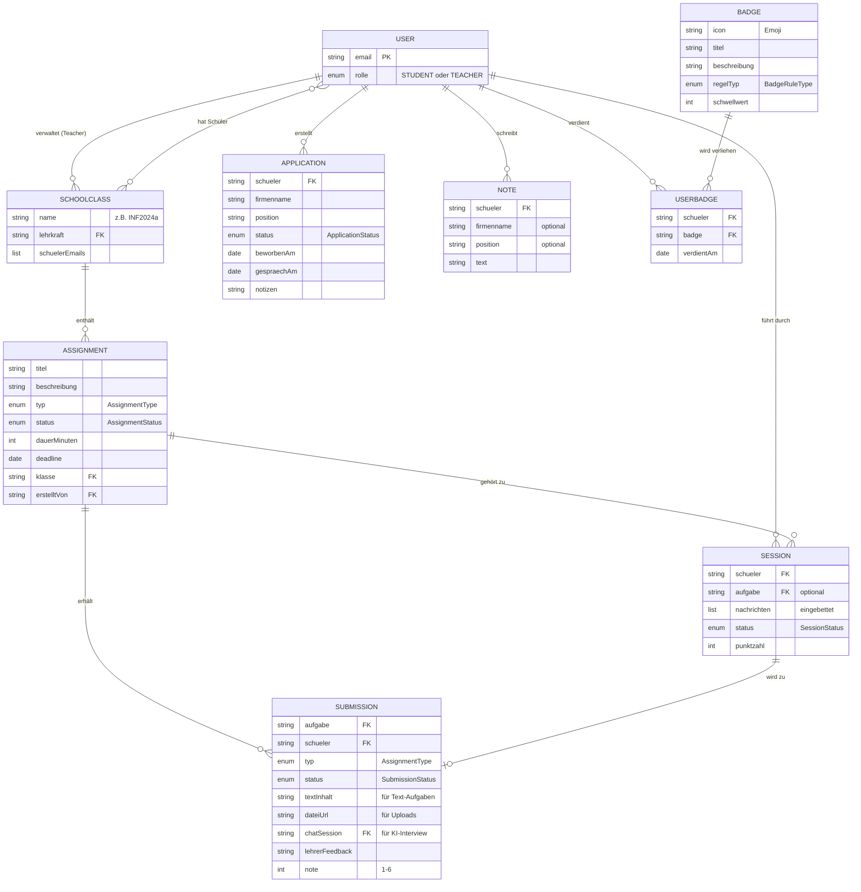
```mermaid
erDiagram
    USER ||--o{ SCHOOLCLASS : "verwaltet (Teacher)"
    USER ||--o{ SESSION : "führt durch"
    USER ||--o{ APPLICATION : "erstellt"
    USER ||--o{ NOTE : "schreibt"
    USER ||--o{ USERBADGE : "verdient"
    
    SCHOOLCLASS ||--o{ ASSIGNMENT : "enthält"
    SCHOOLCLASS }o--o{ USER : "hat Schüler"
    
    ASSIGNMENT ||--o{ SUBMISSION : "erhält"
    ASSIGNMENT ||--o{ SESSION : "gehört zu"
    
    SESSION ||--o| SUBMISSION : "wird zu"
    
    BADGE ||--o{ USERBADGE : "wird verliehen"

    USER {
        string email PK
        enum rolle "STUDENT oder TEACHER"
    }
    
    SCHOOLCLASS {
        string name "z.B. INF2024a"
        string lehrkraft FK
        list schuelerEmails
    }
    
    ASSIGNMENT {
        string titel
        string beschreibung
        enum typ "AssignmentType"
        enum status "AssignmentStatus"
        int dauerMinuten
        date deadline
        string klasse FK
        string erstelltVon FK
    }
    
    SUBMISSION {
        string aufgabe FK
        string schueler FK
        enum typ "AssignmentType"
        enum status "SubmissionStatus"
        string textInhalt "für Text-Aufgaben"
        string dateiUrl "für Uploads"
        string chatSession FK "für KI-Interview"
        string lehrerFeedback
        int note "1-6"
    }
    
    SESSION {
        string schueler FK
        string aufgabe FK "optional"
        list nachrichten "eingebettet"
        enum status "SessionStatus"
        int punktzahl
    }
    
    APPLICATION {
        string schueler FK
        string firmenname
        string position
        enum status "ApplicationStatus"
        date beworbenAm
        date gespraechAm
        string notizen
    }
    
    NOTE {
        string schueler FK
        string firmenname "optional"
        string position "optional"
        string text
    }
    
    BADGE {
        string icon "Emoji"
        string titel
        string beschreibung
        enum regelTyp "BadgeRuleType"
        int schwellwert
    }
    
    USERBADGE {
        string schueler FK
        string badge FK
        date verdientAm
    }
```

---

### Entitäten und Attribute

#### User (extern in Auth0)
Der User wird vollständig von Auth0 verwaltet und existiert nicht als eigene Collection in der MongoDB. Die Authentifizierung erfolgt via JWT-Token.

| Attribut | Typ | Beschreibung |
|----------|-----|--------------|
| **Email** | String | Eindeutige E-Mail-Adresse des Benutzers, dient als Identifikator |
| **Rolle** | Enum | `STUDENT` oder `TEACHER`|

---

#### SchoolClass (Schulklasse)
Eine Schulklasse wird von einer Lehrkraft erstellt und enthält Schüler:innen.

| Attribut | Typ | Beschreibung |
|----------|-----|--------------|
| **Name** | String | Bezeichnung der Klasse (z.B. "INF2024a", "KV2023b") |
| **Lehrkraft** | Referenz | Die Lehrkraft, die diese Klasse verwaltet |
| **Schüler-Emails** | Liste | E-Mail-Adressen aller Schüler:innen in dieser Klasse |

**Besonderheit:** Schüler:innen werden nicht als User-Objekte gespeichert, sondern nur als Email-Liste. Beim Login wird geprüft, ob die Email in einer Klasse vorkommt.

---

#### Assignment (Aufgabe)
Eine Aufgabe wird von einer Lehrkraft für eine Klasse erstellt.

| Attribut | Typ | Beschreibung |
|----------|-----|--------------|
| **Titel** | String | Bezeichnung der Aufgabe (z.B. "Bewerbungsgespräch üben") |
| **Beschreibung** | String | Detaillierte Anweisungen für die Schüler:innen |
| **Typ** | Enum | Art der Aufgabe (siehe `AssignmentType`) |
| **Status** | Enum | Aktueller Zustand (siehe `AssignmentStatus`) |
| **Dauer (Minuten)** | Integer | Empfohlene/maximale Bearbeitungszeit |
| **Deadline** | Datum | Abgabefrist der Aufgabe |
| **Klasse** | Referenz | Die Schulklasse, der diese Aufgabe zugewiesen ist |
| **Erstellt von** | Referenz | Die Lehrkraft, die diese Aufgabe erstellt hat |

---

#### Submission (Abgabe)
Eine Abgabe wird von einem Schüler für eine Aufgabe eingereicht.

| Attribut | Typ | Beschreibung |
|----------|-----|--------------|
| **Aufgabe** | Referenz | Die zugehörige Aufgabe |
| **Schüler** | String | Email der/des Schüler:in |
| **Typ** | Enum | Übernommen von der Aufgabe (siehe `AssignmentType`) |
| **Status** | Enum | Bearbeitungsstatus (siehe `SubmissionStatus`) |
| **Textinhalt** | String | Bei Selbstreflexion/Recherche: Der geschriebene Text |
| **Links** | Liste | Bei Recherche: Gesammelte Links |
| **Datei-URL** | String | Bei Dokument/Video: URL zur hochgeladenen Datei |
| **Dateiname** | String | Original-Dateiname |
| **Kommentar** | String | Optionaler Kommentar des Schülers |
| **Chat-Session** | Referenz | Bei KI-Interview: Verweis auf die Chat-Session |
| **Lehrkraft-Feedback** | String | Rückmeldung der Lehrkraft |
| **Note** | Integer | Bewertung (1-6, optional) |

---

#### Session (KI-Chat-Session)
Eine Chat-Session repräsentiert ein Gespräch zwischen Schüler:in und KI.

| Attribut | Typ | Beschreibung |
|----------|-----|--------------|
| **Schüler** | Referenz | Der/die Schüler:in, der/die chattet |
| **Aufgabe** | Referenz | Optional: Die zugehörige Aufgabe (null bei freiem Training) |
| **Aufgabentitel** | String | Titel der Aufgabe (wenn vorhanden) |
| **Soll-Dauer** | Integer | Minuten von der Aufgabe (für Timer) |
| **Nachrichten** | Liste | Alle Nachrichten im Chat (eingebettete Dokumente) |
| **Punktzahl** | Integer | Von der KI berechnete Bewertung |
| **Status** | Enum | Siehe `SessionStatus` |
| **Als Aufgabe abgegeben** | Boolean | Wurde diese Session als Submission eingereicht? |

**SessionMessage (eingebettetes Dokument):**

| Attribut | Typ | Beschreibung |
|----------|-----|--------------|
| **Rolle** | String | `"user"` oder `"assistant"` |
| **Inhalt** | String | Nachrichtentext |

---

#### Application (Bewerbung)
Eine Bewerbung dokumentiert den Bewerbungsprozess eines Schülers bei einer Firma.

| Attribut | Typ | Beschreibung |
|----------|-----|--------------|
| **Schüler** | Referenz | Der/die Schüler:in |
| **Firmenname** | String | Name des Unternehmens (z.B. "Swisscom", "Migros") |
| **Position** | String | Die angestrebte Stelle (z.B. "Informatiker EFZ") |
| **Status** | Enum | Aktueller Stand (siehe `ApplicationStatus`) |
| **Beworben am** | Datum | Datum der Bewerbung |
| **Gespräch am** | Datum | Datum des Vorstellungsgesprächs (optional) |
| **Notizen** | String | Persönliche Anmerkungen |

---

#### Note (Notiz)
Eine Notiz ist eine persönliche Aufzeichnung eines Schülers.

| Attribut | Typ | Beschreibung |
|----------|-----|--------------|
| **Schüler** | Referenz | Der/die Schüler:in |
| **Firmenname** | String | Optional: Zugehörige Firma |
| **Position** | String | Optional: Zugehörige Stelle |
| **Text** | String | Der Inhalt der Notiz |

---

#### Badge (Abzeichen-Definition)
Ein Badge ist eine Auszeichnung, die Schüler:innen für bestimmte Leistungen erhalten können.

| Attribut | Typ | Beschreibung |
|----------|-----|--------------|
| **Icon** | String | Emoji des Badges (🎯, 🔥, 🏆, etc.) |
| **Titel** | String | Bezeichnung (z.B. "Erste Session", "Interview-Profi") |
| **Beschreibung** | String | Erklärung, wie der Badge verdient wird |
| **Regel-Typ** | Enum | Art der Vergaberegel (siehe `BadgeRuleType`) |
| **Schwellwert** | Integer | Anzahl, die erreicht werden muss |

---

#### UserBadge (Verdientes Badge)
Verknüpfungstabelle zwischen Schüler:innen und ihren verdienten Badges.

| Attribut | Typ | Beschreibung |
|----------|-----|--------------|
| **Schüler** | Referenz | Der/die Schüler:in |
| **Badge** | Referenz | Der verdiente Badge |
| **Verdient am** | Datum | Zeitpunkt der Vergabe |

**Besonderheit:** Compound Index auf (Schüler, Badge) verhindert doppelte Vergabe.

---

### Beziehungen

| Beziehung | Kardinalität | Beschreibung |
|-----------|--------------|--------------|
| User → SchoolClass | 1:n | Eine Lehrkraft verwaltet mehrere Klassen |
| SchoolClass → User | n:m | Schüler:innen gehören zu Klassen (via Email-Liste) |
| SchoolClass → Assignment | 1:n | Eine Klasse enthält mehrere Aufgaben |
| User → Assignment | 1:n | Eine Lehrkraft erstellt mehrere Aufgaben |
| Assignment → Submission | 1:n | Eine Aufgabe erhält mehrere Abgaben (von verschiedenen Schülern) |
| User → Submission | 1:n | Ein:e Schüler:in macht mehrere Abgaben |
| User → Session | 1:n | Ein:e Schüler:in führt mehrere Chat-Sessions |
| Assignment → Session | 1:n | Eine Aufgabe kann mehrere Sessions haben (optional) |
| Session → Submission | 1:1 | Eine Session kann zu genau einer Abgabe werden |
| User → Application | 1:n | Ein:e Schüler:in hat mehrere Bewerbungen |
| User → Note | 1:n | Ein:e Schüler:in erstellt mehrere Notizen |
| User → UserBadge | 1:n | Ein:e Schüler:in verdient mehrere Badges |
| Badge → UserBadge | 1:n | Ein Badge wird an mehrere Schüler:innen vergeben |

---

## Enumerationen (Enums)

Die folgenden Enums definieren die gültigen Werte für verschiedene Attribute im Datenmodell.

### AssignmentType (Aufgabentyp)

Definiert die verschiedenen Arten von Aufgaben, die eine Lehrkraft erstellen kann.

| Wert | Anzeigename | Icon | Beschreibung | Abgabe-Anforderung |
|------|-------------|------|--------------|-------------------|
| `AI_INTERVIEW` | KI-Bewerbungsgespräch | 🤖 | Übe ein Bewerbungsgespräch mit der KI | `chatSessionId` muss vorhanden sein |
| `DOCUMENT_UPLOAD` | Dokument einreichen | 📄 | Lade ein Dokument hoch (PDF, Word) | `fileUrl` muss vorhanden sein |
| `SELF_REFLECTION` | Selbstreflexion | ✍️ | Schreibe eine Reflexion zu einem Thema | `textContent` ≥ 50 Zeichen |
| `VIDEO_PITCH` | Video-Bewerbung | 🎥 | Nimm ein kurzes Bewerbungsvideo auf | `fileUrl` muss vorhanden sein |
| `RESEARCH` | Recherche | 🔍 | Recherchiere zu einem Thema und fasse zusammen | `textContent` ≥ 50 Zeichen |

**Code-Referenz:** `AssignmentType.java` enthält `displayName` und `description` als Attribute.

---

### AssignmentStatus (Aufgabenstatus)

Definiert den Lebenszyklus einer Aufgabe.

| Wert | Beschreibung | Übergang von | Übergang zu |
|------|--------------|--------------|-------------|
| `ASSIGNED` | Aufgabe wurde der Klasse zugewiesen, noch nicht begonnen | - | `IN_PROGRESS` |
| `IN_PROGRESS` | Mindestens ein:e Schüler:in arbeitet an der Aufgabe | `ASSIGNED` | `SUBMITTED` |
| `SUBMITTED` | Abgabe wurde eingereicht | `IN_PROGRESS` | `REVIEWED` |
| `REVIEWED` | Lehrkraft hat Feedback gegeben | `SUBMITTED` | `CLOSED` |
| `CLOSED` | Aufgabe geschlossen, keine weiteren Abgaben möglich | `REVIEWED` | - |

---

### SubmissionStatus (Abgabestatus)

Definiert den Bewertungs-Workflow einer Abgabe.

| Wert | Anzeigename | Farbe | Beschreibung |
|------|-------------|-------|--------------|
| `SUBMITTED` | Eingereicht | 🟡 Gelb | Schüler:in hat abgegeben, wartet auf Bewertung |
| `IN_REVIEW` | In Prüfung | 🟠 Orange | Lehrkraft hat die Abgabe geöffnet und prüft |
| `REVIEWED` | Bewertet | 🟢 Grün | Feedback und/oder Note wurden vergeben |
| `RETURNED` | Zurückgegeben | 🔵 Blau | Feedback wurde an Schüler:in kommuniziert |

**Code-Referenz:** `SubmissionStatus.java` enthält `displayName` für die Anzeige im Frontend.

---

### SessionStatus (Session-Status)

Definiert den Zustand einer KI-Chat-Session.

| Wert | Beschreibung | Aktionen möglich |
|------|--------------|------------------|
| `OPEN` | Session ist aktiv, Chat läuft | Nachrichten senden, Session beenden oder abgeben |
| `CLOSED` | Session wurde beendet | Nur noch lesen, nicht mehr fortsetzen |

**Besonderheit:** Wenn eine Session als Aufgabe abgegeben wird (`submittedAsAssignment = true`), wechselt der Status zu `CLOSED` und eine `Submission` wird automatisch erstellt.

---

### ApplicationStatus (Bewerbungsstatus)

Definiert den Fortschritt einer echten Bewerbung bei einer Firma.

| Wert | Anzeigename | Emoji | Farbe | Beschreibung | Typischer nächster Schritt |
|------|-------------|-------|-------|--------------|---------------------------|
| `PLANNED` | Geplant | 📝 | Grau | Bewerbung ist vorgemerkt, noch nicht abgeschickt | Bewerbung schreiben und abschicken |
| `APPLIED` | Beworben | 📤 | Blau | Bewerbung wurde abgeschickt, wartet auf Antwort | Auf Rückmeldung warten |
| `INVITED` | Eingeladen | 📅 | Gelb | Einladung zum Vorstellungsgespräch erhalten | Termin vorbereiten |
| `INTERVIEW_DONE` | Gespräch absolviert | ✅ | Orange | Vorstellungsgespräch wurde geführt | Auf Entscheidung warten |
| `ACCEPTED` | Zusage | 🎉 | Grün | Lehrstelle erhalten! | Vertrag unterschreiben |
| `REJECTED` | Absage | ❌ | Rot | Absage erhalten | Weiter bewerben |
| `WITHDRAWN` | Zurückgezogen | 🔙 | Grau | Bewerbung selbst zurückgezogen | - |

**Verwendung im Frontend:** Status-Badges werden farblich und mit Emoji dargestellt. Dropdown in der Tabelle ermöglicht schnelle Statusänderung.

---

### BadgeRuleType (Badge-Regeltyp)

Definiert, nach welcher Regel ein Badge vergeben wird.

| Wert | Beschreibung | Schwellwert-Bedeutung | Beispiel |
|------|--------------|----------------------|----------|
| `SESSIONS_COMPLETED` | Anzahl abgeschlossener KI-Sessions | Anzahl Sessions | "5 Sessions" → threshold: 5 |
| `NOTES_CREATED` | Anzahl erstellter Notizen | Anzahl Notizen | "10 Notizen" → threshold: 10 |
| `APPLICATIONS_CREATED` | Anzahl erstellter Bewerbungen | Anzahl Bewerbungen | "3 Bewerbungen" → threshold: 3 |
| `APPLICATION_STATUS` | Bewerbung mit bestimmtem Status erreicht | Ordinal des Status | "Erste Einladung" → threshold: 2 (INVITED) |
| `SUBMISSIONS_COMPLETED` | Anzahl abgegebener Aufgaben | Anzahl Submissions | "5 Abgaben" → threshold: 5 |
| `FEEDBACK_RECEIVED` | Anzahl erhaltenes Feedback von Lehrkraft | Anzahl Feedbacks | "10 Feedbacks" → threshold: 10 |
| `GRADES_RECEIVED` | Anzahl erhaltener Noten | Anzahl Noten | "5 Noten" → threshold: 5 |

**Badge-Übersicht (37 Badges gesamt):**

| Kategorie | Regel-Typ | Schwellwerte | Anzahl |
|-----------|-----------|--------------|--------|
| KI-Training | `SESSIONS_COMPLETED` | 1, 3, 5, 10, 15, 25, 50, 100 | 8 |
| Notizen | `NOTES_CREATED` | 1, 5, 10, 25, 50 | 5 |
| Bewerbungen | `APPLICATIONS_CREATED` | 1, 3, 5, 10, 15, 25 | 6 |
| Bewerbungs-Meilensteine | `APPLICATION_STATUS` | APPLIED, INVITED, INTERVIEW_DONE, ACCEPTED | 4 |
| Aufgaben-Abgaben | `SUBMISSIONS_COMPLETED` | 1, 3, 5, 10, 20, 50 | 6 |
| Feedback | `FEEDBACK_RECEIVED` | 1, 5, 10, 25 | 4 |
| Bewertungen | `GRADES_RECEIVED` | 1, 5, 10, 25 | 4 |

---

## Zustandsdiagramme

Die folgenden Entitäten durchlaufen mehrere Zustände während ihres Lebenszyklus.

### Assignment (Aufgabe)

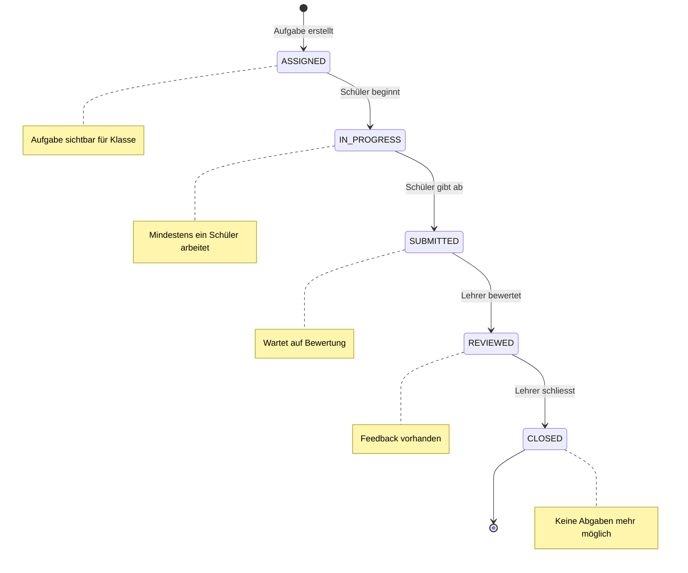
```mermaid
stateDiagram-v2
    [*] --> ASSIGNED : Aufgabe erstellt
    ASSIGNED --> IN_PROGRESS : Schüler beginnt
    IN_PROGRESS --> SUBMITTED : Schüler gibt ab
    SUBMITTED --> REVIEWED : Lehrer bewertet
    REVIEWED --> CLOSED : Lehrer schliesst
    CLOSED --> [*]
    
    note right of ASSIGNED : Aufgabe sichtbar für Klasse
    note right of IN_PROGRESS : Mindestens ein Schüler arbeitet
    note right of SUBMITTED : Wartet auf Bewertung
    note right of REVIEWED : Feedback vorhanden
    note right of CLOSED : Keine Abgaben mehr möglich
```

**Zustandsübergänge im Detail:**

| Von | Nach | Trigger | Aktion im Backend |
|-----|------|---------|-------------------|
| - | `ASSIGNED` | Lehrkraft erstellt Aufgabe | `POST /api/assignment` |
| `ASSIGNED` | `IN_PROGRESS` | Schüler startet Session | Automatisch bei erster Session |
| `IN_PROGRESS` | `SUBMITTED` | Schüler gibt ab | `PUT /api/sessions/{id}/submit` |
| `SUBMITTED` | `REVIEWED` | Lehrkraft gibt Feedback | `PUT /api/submissions/{id}/feedback` |
| `REVIEWED` | `CLOSED` | Lehrkraft schliesst | `PUT /api/assignments/{id}/status` |

---

### Submission (Abgabe)

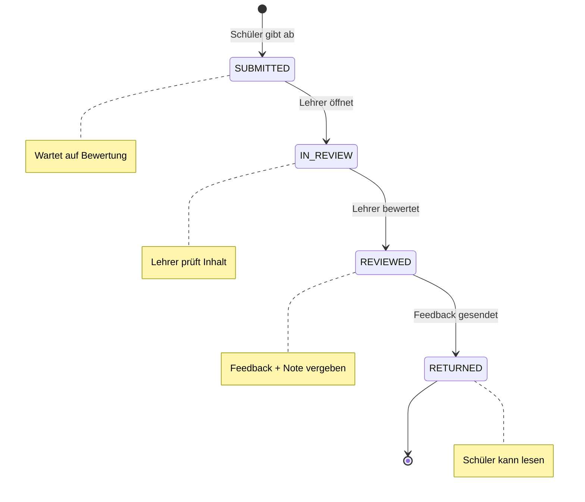
```mermaid
stateDiagram-v2
    [*] --> SUBMITTED : Schüler gibt ab
    SUBMITTED --> IN_REVIEW : Lehrer öffnet
    IN_REVIEW --> REVIEWED : Lehrer bewertet
    REVIEWED --> RETURNED : Feedback gesendet
    RETURNED --> [*]
    
    note right of SUBMITTED : Wartet auf Bewertung
    note right of IN_REVIEW : Lehrer prüft Inhalt
    note right of REVIEWED : Feedback + Note vergeben
    note right of RETURNED : Schüler kann lesen
```

**Zustandsübergänge im Detail:**

| Von | Nach | Trigger | Aktion im Backend |
|-----|------|---------|-------------------|
| - | `SUBMITTED` | Schüler gibt ab | `POST /api/submissions` oder `PUT /api/sessions/{id}/submit` |
| `SUBMITTED` | `IN_REVIEW` | Lehrkraft öffnet Abgabe | Automatisch beim Öffnen |
| `IN_REVIEW` | `REVIEWED` | Lehrkraft speichert Feedback | `PUT /api/submissions/{id}/feedback` |
| `REVIEWED` | `RETURNED` | System benachrichtigt Schüler | Automatisch nach Feedback |

---

### Session (KI-Chat-Session)

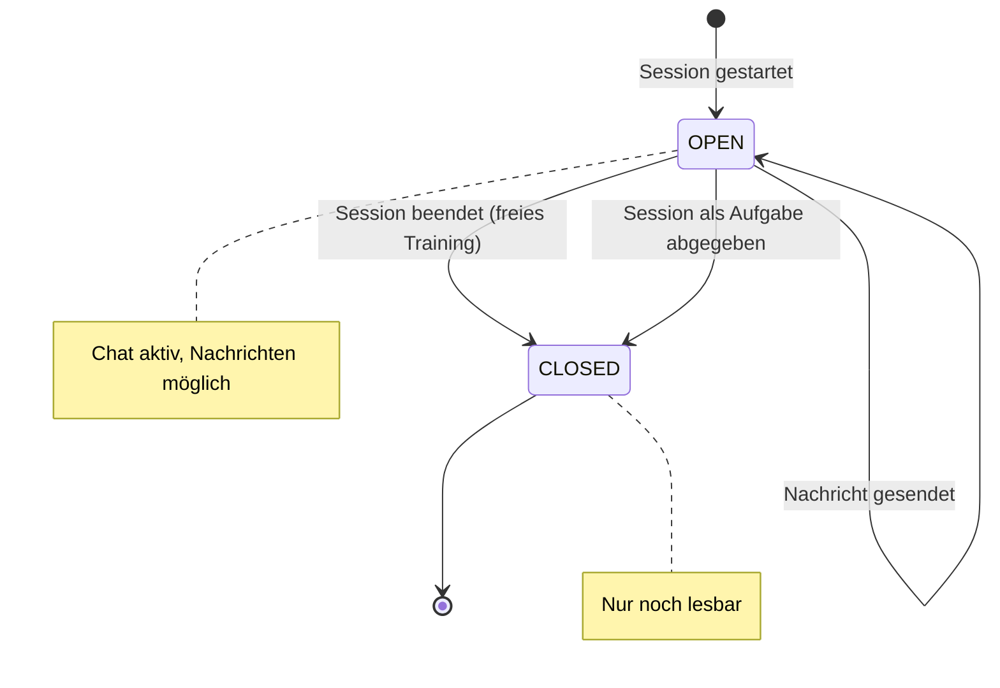
```mermaid
stateDiagram-v2
    [*] --> OPEN : Session gestartet
    OPEN --> OPEN : Nachricht gesendet
    OPEN --> CLOSED : Session beendet (freies Training)
    OPEN --> CLOSED : Session als Aufgabe abgegeben
    CLOSED --> [*]
    
    note right of OPEN : Chat aktiv, Nachrichten möglich
    note right of CLOSED : Nur noch lesbar
```

**Zustandsübergänge im Detail:**

| Von | Nach | Trigger | Aktion im Backend |
|-----|------|---------|-------------------|
| - | `OPEN` | Schüler startet Session | `POST /api/sessions` |
| `OPEN` | `OPEN` | Nachricht senden | `POST /api/sessions/{id}/messages` |
| `OPEN` | `CLOSED` | Session beenden (frei) | `PUT /api/sessions/{id}/close` |
| `OPEN` | `CLOSED` | Als Aufgabe abgeben | `PUT /api/sessions/{id}/submit` (setzt auch `submittedAsAssignment = true`) |

**Besonderheit:** Bei Abgabe als Aufgabe wird automatisch eine `Submission` mit Referenz auf die Session erstellt.

---

### Application (Bewerbung)

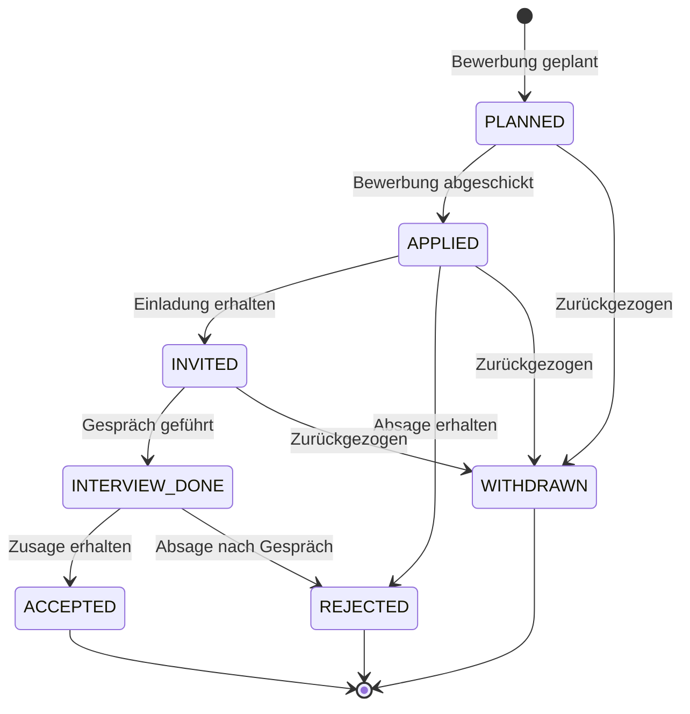
```mermaid
stateDiagram-v2
    [*] --> PLANNED : Bewerbung geplant
    PLANNED --> APPLIED : Bewerbung abgeschickt
    APPLIED --> INVITED : Einladung erhalten
    APPLIED --> REJECTED : Absage erhalten
    INVITED --> INTERVIEW_DONE : Gespräch geführt
    INTERVIEW_DONE --> ACCEPTED : Zusage erhalten
    INTERVIEW_DONE --> REJECTED : Absage nach Gespräch
    
    PLANNED --> WITHDRAWN : Zurückgezogen
    APPLIED --> WITHDRAWN : Zurückgezogen
    INVITED --> WITHDRAWN : Zurückgezogen
    
    ACCEPTED --> [*]
    REJECTED --> [*]
    WITHDRAWN --> [*]
```

**Zustandsübergänge im Detail:**

| Von | Nach | Trigger | Badge-Prüfung |
|-----|------|---------|---------------|
| - | `PLANNED` | Bewerbung erfasst | `APPLICATIONS_CREATED` |
| `PLANNED` | `APPLIED` | Status geändert | `APPLICATION_STATUS` (APPLIED) |
| `APPLIED` | `INVITED` | Einladung eingetragen | `APPLICATION_STATUS` (INVITED) |
| `INVITED` | `INTERVIEW_DONE` | Gespräch markiert | `APPLICATION_STATUS` (INTERVIEW_DONE) |
| `INTERVIEW_DONE` | `ACCEPTED` | Zusage erhalten | `APPLICATION_STATUS` (ACCEPTED) 🎉 |
| * | `REJECTED` | Absage erhalten | - |
| * | `WITHDRAWN` | Selbst zurückgezogen | - |

**Hinweis:** Jeder Statuswechsel löst `BadgeService.checkAndAwardBadges()` aus, um Meilenstein-Badges zu vergeben.

---

## UI-Mockups

Vor der Implementierung wurden Wireframe-Mockups erstellt, um die Benutzeroberfläche zu planen. Die Mockups dienten als Grundlage für Diskussionen und halfen, die Anforderungen zu visualisieren bevor Code geschrieben wurde.

### Design-Prinzipien

Bei der Gestaltung der Mockups wurden folgende Überlegungen berücksichtigt:

- **Konsistente Navigation:** Beide Rollen (Student/Teacher) haben eine fixe Navigation im Header mit allen relevanten Bereichen
- **Dashboard als Einstiegspunkt:** Nach dem Login landet der Benutzer auf einem Dashboard mit Übersicht und Schnellzugriff
- **Statistik-Karten:** Wichtige Kennzahlen werden prominent als Karten dargestellt
- **Karten-basiertes Layout:** Inhalte wie Aufgaben und Sessions werden als übersichtliche Karten dargestellt
- **Klare Aktionen:** Jede Ansicht hat eindeutige Buttons für die wichtigsten Aktionen

---

### Student-Ansichten

#### Dashboard
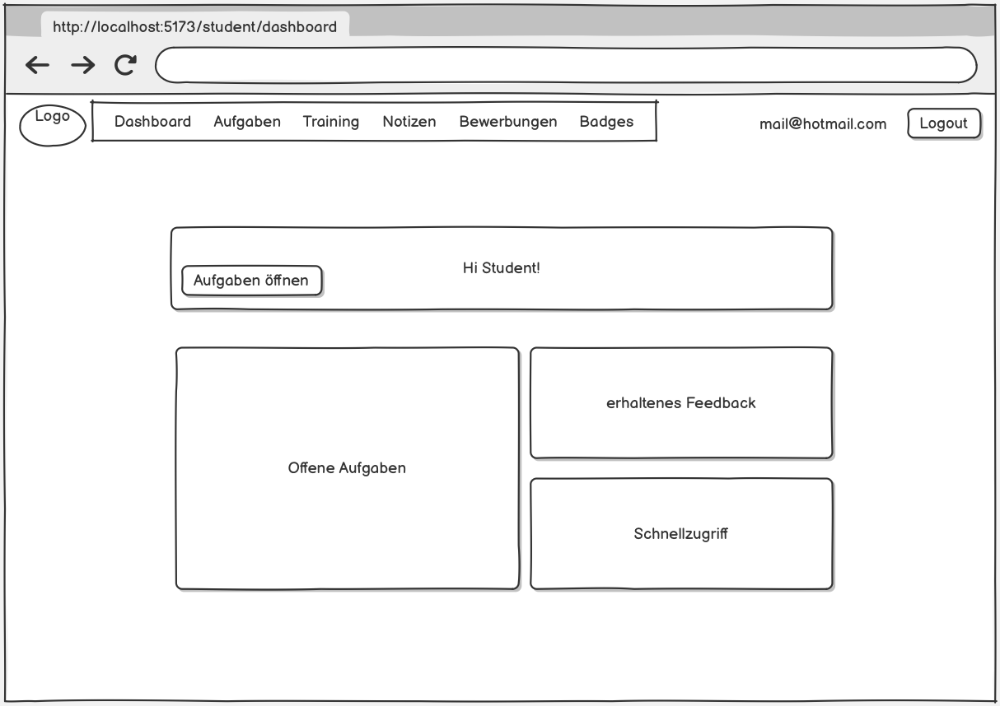

Das Student-Dashboard wurde als zentrale Anlaufstelle konzipiert. Die Überlegung war, dass Schüler:innen beim Öffnen der App sofort sehen sollen, was ansteht.

**Design-Entscheidungen:**
- Begrüssung mit Name für persönliche Ansprache
- "Aufgaben öffnen" Button prominent platziert, da dies die häufigste Aktion ist
- Drei Hauptbereiche: Offene Aufgaben (wichtigste Info), erhaltenes Feedback (Motivation), Schnellzugriff (Navigation)
- Navigation mit allen Bereichen: Dashboard, Aufgaben, Training, Notizen, Bewerbungen, Badges

#### Aufgaben-Übersicht
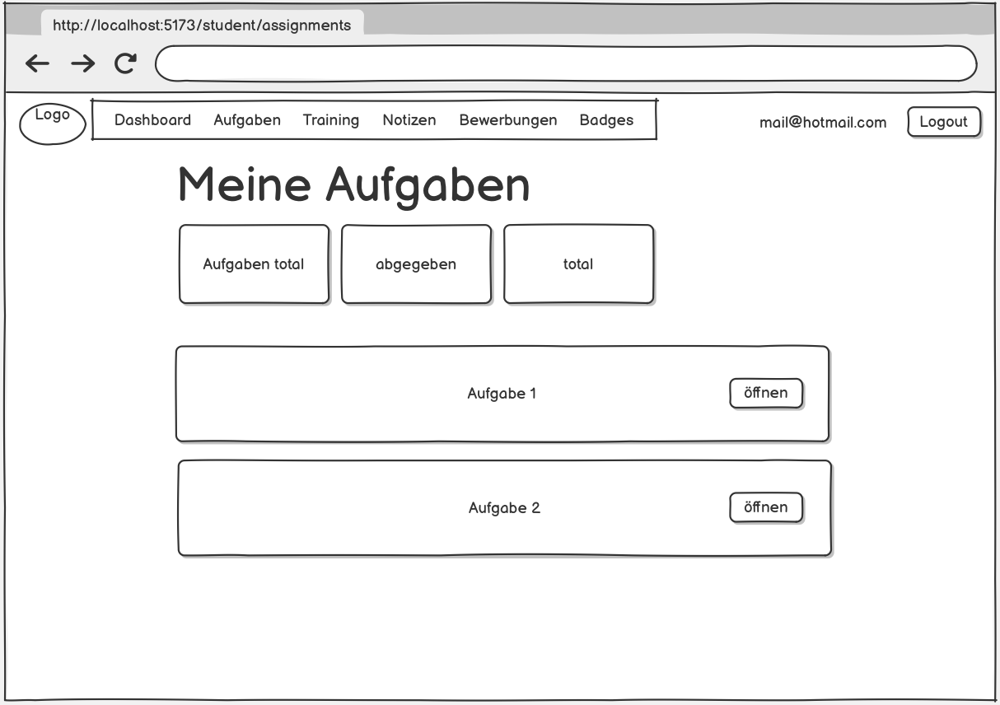

Die Aufgaben-Übersicht zeigt alle Aufgaben der Lehrperson auf einen Blick.

**Design-Entscheidungen:**
- Statistik-Karten oben für schnellen Überblick (Total, Abgegeben, Offen)
- Aufgaben als Karten mit "öffnen" Button
- Einfaches Layout ohne Ablenkung, Fokus auf die Aufgaben selbst

#### Session-Übersicht
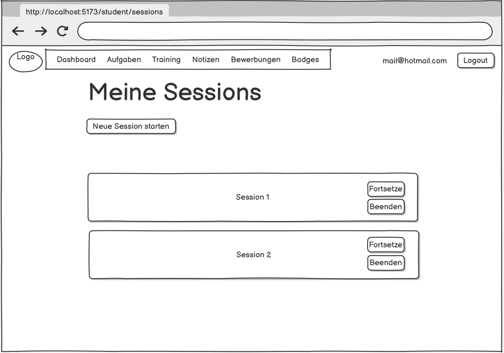

Hier sieht der Schüler alle seine KI-Training-Sessions.

**Design-Entscheidungen:**
- "Neue Session starten" Button prominent oben platziert
- Sessions als Karten mit zwei Aktionen: "Fortsetze" (weitermachen) und "Beenden" (abschliessen)
- Einfache Darstellung ohne komplexe Filterung

#### KI-Chat
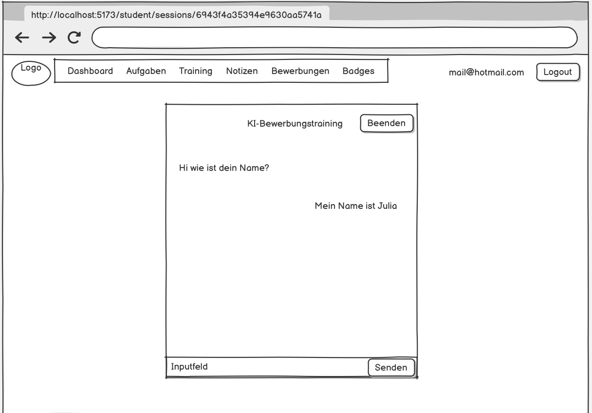

Das Chat-Interface für das KI-Bewerbungstraining.

**Design-Entscheidungen:**
- Klassisches Chat-Layout: KI-Nachrichten links, eigene Nachrichten rechts
- Header mit Titel "KI-Bewerbungstraining" und "Beenden" Button
- Eingabefeld unten mit "Senden" Button
- Fokus auf den Gesprächsverlauf, keine Ablenkung durch andere Elemente

---

### Teacher-Ansichten

#### Dashboard
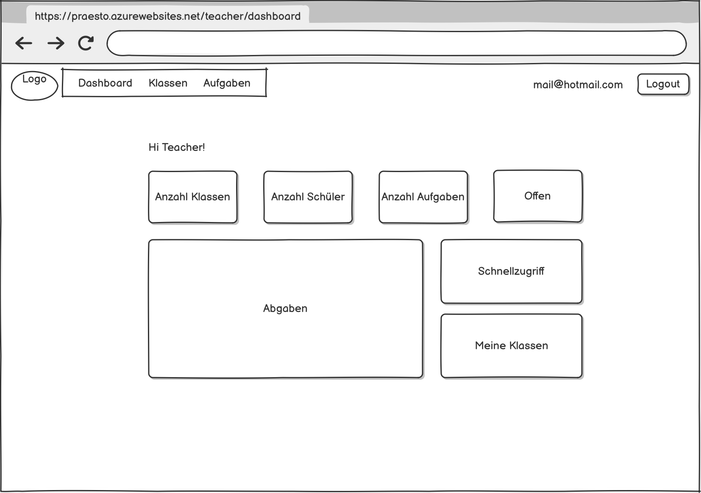

Das Teacher-Dashboard fokussiert auf Klassenmanagement und ausstehende Aufgaben.

**Design-Entscheidungen:**
- Vier Statistik-Karten: Anzahl Klassen, Schüler, Aufgaben, Offene
- Abgaben-Bereich für schnellen Zugriff auf zu bewertende Arbeiten
- Schnellzugriff und "Meine Klassen" rechts für häufige Aktionen
- Reduzierte Navigation (nur Dashboard, Klassen, Aufgaben) im Vergleich zu Student

#### Klassenverwaltung
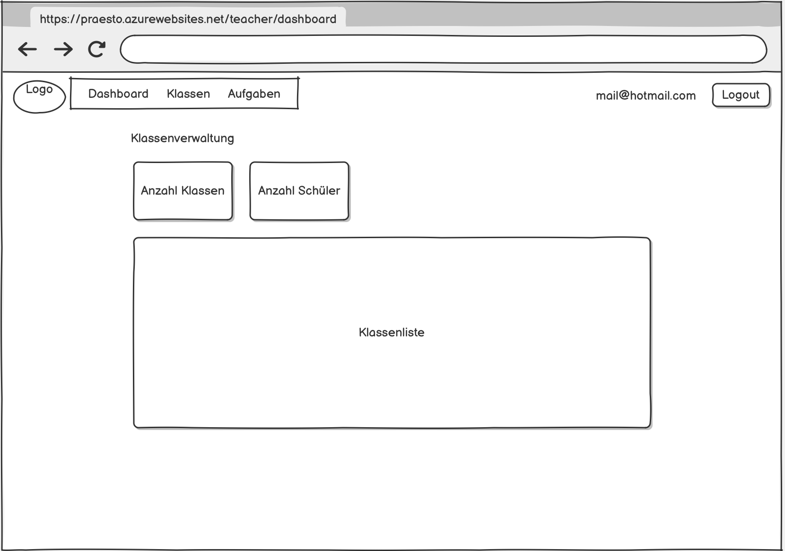

Verwaltung der Schulklassen mit Schülerzuordnung.

**Design-Entscheidungen:**
- Statistik-Karten für Übersicht (Anzahl Klassen, Anzahl Schüler)
- Klassenliste als Hauptelement
- Einfaches Layout für unkomplizierte Verwaltung

#### Aufgaben-Übersicht
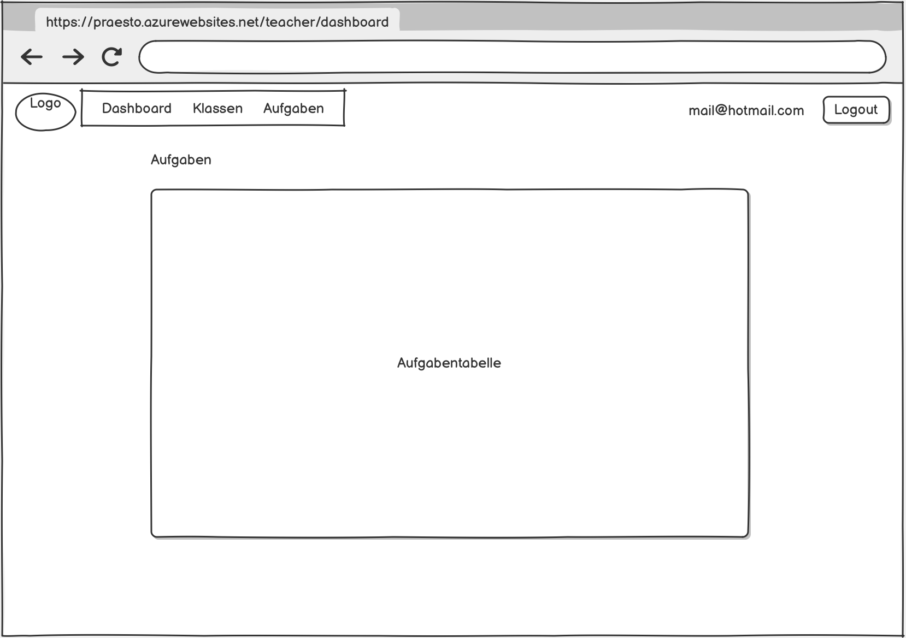

Alle erstellten Aufgaben in tabellarischer Form.

**Design-Entscheidungen:**
- Tabellen-Layout für bessere Übersicht bei vielen Aufgaben
- Alle relevanten Infos auf einen Blick (Klasse, Deadline, Status)

#### Aufgabe erstellen
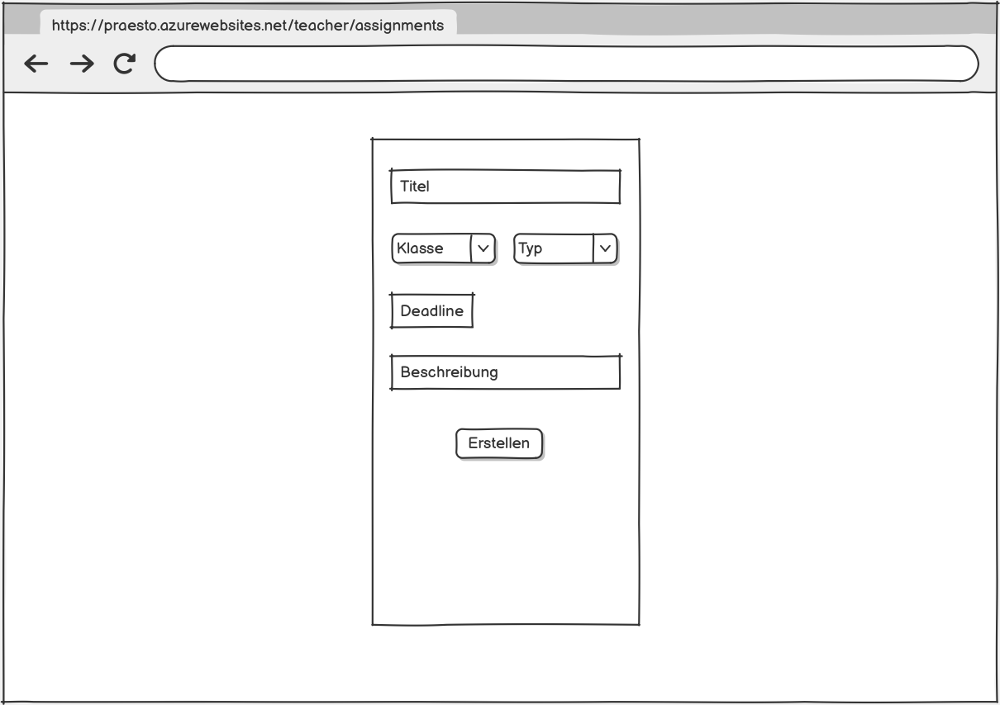

Formular zum Erstellen einer neuen Aufgabe.

**Design-Entscheidungen:**
- Alle Felder untereinander für klare Struktur
- Pflichtfelder: Titel, Klasse (Dropdown), Typ (Dropdown), Deadline
- Optionales Beschreibungsfeld für Details
- "Erstellen" Button am Ende des Formulars

#### Aufgaben-Detail
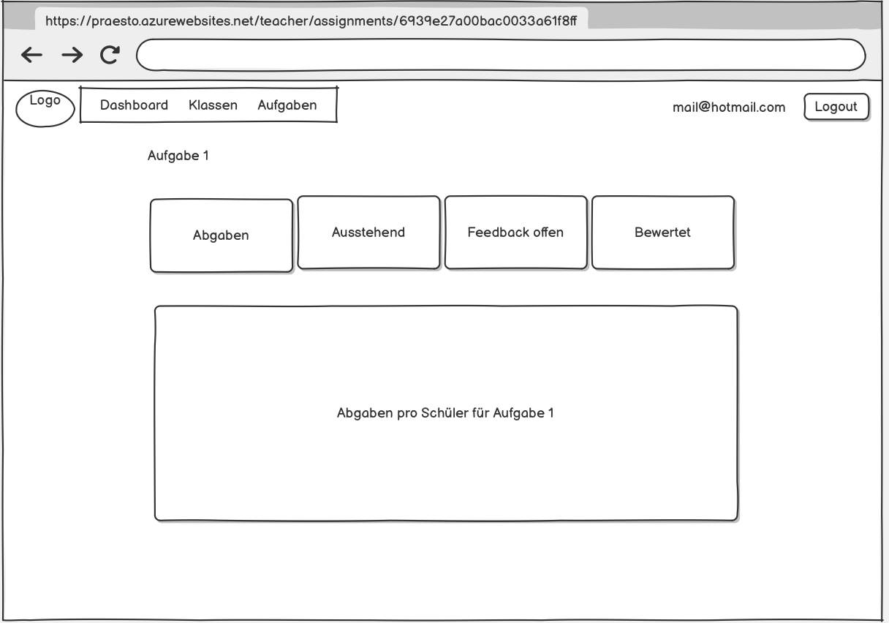

Detailansicht einer Aufgabe mit allen Schülerabgaben.

**Design-Entscheidungen:**
- Vier Statistik-Karten für Abgabe-Status: Abgaben, Ausstehend, Feedback offen, Bewertet
- Liste aller Abgaben pro Schüler darunter
- Ermöglicht der Lehrperson, den Fortschritt der Klasse zu sehen

---

### Umsetzung

Die finalen Screenshots zeigen, dass die Grundstruktur der Mockups beibehalten wurde. Während der Implementierung wurden Details verfeinert:

- Farbschema (Lila/Orange) für bessere visuelle Hierarchie
- Icons und Emojis für schnellere Orientierung
- Responsive Anpassungen für verschiedene Bildschirmgrössen
- Zusätzliche Features wie Filter und Sortierung wo sinnvoll

---

# Implementation

## Technologie-Stack

| Bereich | Technologie |
|---------|-------------|
| **Backend** | Spring Boot 3.x, Java 17+ |
| **KI-Integration** | Spring AI + OpenAI GPT-4 |
| **Datenbank** | MongoDB Atlas |
| **Authentifizierung** | Auth0 (OAuth2/JWT) |
| **Frontend** | SvelteKit, Svelte 5 |
| **Styling** | Eigenes CSS Design System |
| **HTTP Client** | Axios |

---

## Frontend

Das Frontend bietet separate Ansichten für Schüler:innen und Lehrkräfte. Nach dem Login wird basierend auf der Rolle automatisch zum richtigen Dashboard weitergeleitet.

---

### Authentifizierung

#### Registrierung
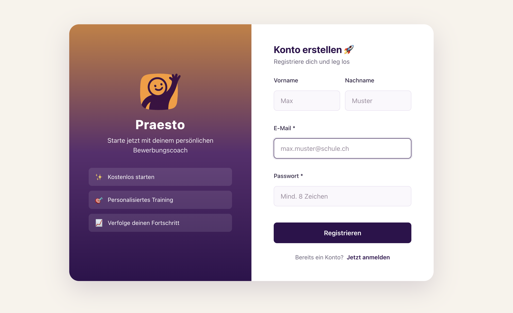

Neue Benutzer können sich selbständig registrieren. Dazu müssen folgende Angaben gemacht werden:

- **Vorname und Nachname:** Werden für die Anzeige in der App verwendet
- **E-Mail-Adresse:** Dient als Login-Name und wird verwendet, um Schüler:innen einer Klasse zuzuordnen. Die Lehrperson fügt die E-Mail-Adresse zur Klasse hinzu, und sobald sich der Schüler mit dieser Adresse registriert, wird er automatisch der Klasse zugewiesen.
- **Passwort:** Mindestens 8 Zeichen

Nach der Registrierung kann sich der Benutzer direkt anmelden.

#### Login
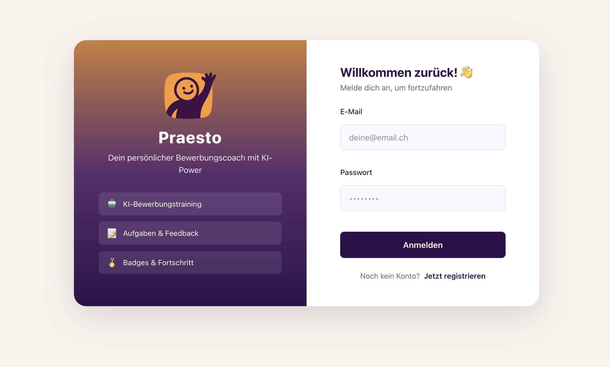

Bestehende Benutzer melden sich mit E-Mail und Passwort an. Die Anwendung erkennt automatisch die Rolle des Benutzers (Student oder Teacher) und leitet zum entsprechenden Dashboard weiter.

Die linke Seite zeigt die Kernfunktionen der App:
- KI-Bewerbungstraining
- Aufgaben & Feedback
- Badges & Fortschritt

---

### Student-Ansichten

#### Dashboard
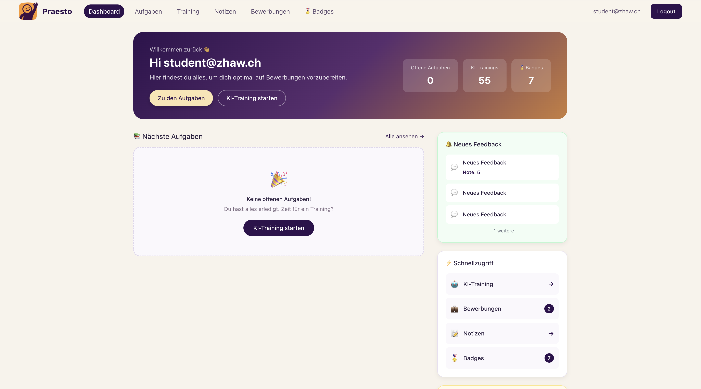

Das Dashboard ist die Startseite für Schüler:innen und bietet einen Überblick über alle relevanten Informationen:

**Statistik-Bereich (oben rechts):**
- Anzahl offener Aufgaben
- Anzahl absolvierter KI-Trainings
- Anzahl verdiente Badges

**Nächste Aufgaben:**
Zeigt die anstehenden Aufgaben mit Deadline. Wenn keine Aufgaben offen sind, wird ein Hinweis angezeigt mit der Möglichkeit, direkt ein KI-Training zu starten.

**Neues Feedback:**
Liste der kürzlich erhaltenen Bewertungen von der Lehrperson. Ein Klick führt direkt zur bewerteten Aufgabe.

**Schnellzugriff:**
Direkte Links zu allen Bereichen der App mit Badges, die aktuelle Zahlen anzeigen (z.B. "2" bei Bewerbungen bedeutet 2 aktive Bewerbungen).

---

#### Aufgaben-Übersicht
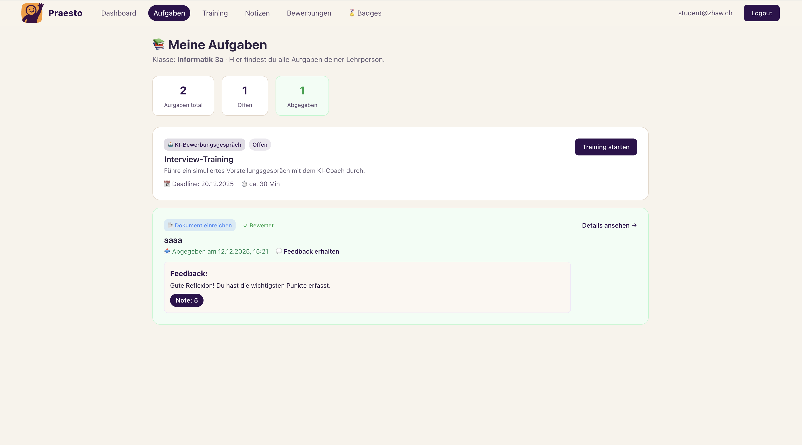

Zeigt alle Aufgaben, die der Schüler von seiner Lehrperson erhalten hat.

**Statistik:**
- Aufgaben total
- Offen (noch nicht bearbeitet)
- Abgegeben (eingereicht, wartet auf Bewertung oder bereits bewertet)

**Aufgabenliste:**
Jede Aufgabe zeigt:
- **Typ-Badge:** Zeigt den Aufgabentyp (z.B. "KI-Bewerbungsgespräch", "Dokument einreichen", "Recherche")
- **Status:** Offen, Abgegeben, oder Bewertet
- **Titel und Beschreibung:** Was der Schüler tun soll
- **Deadline:** Bis wann die Aufgabe erledigt sein muss
- **Geschätzte Dauer:** Wie viel Zeit eingeplant werden sollte

Bei offenen Aufgaben gibt es einen Button zum direkten Starten (z.B. "Training starten" bei KI-Aufgaben).

Bei bewerteten Aufgaben wird das Feedback und die Note direkt in der Übersicht angezeigt.

#### Aufgabe Detail (offen)
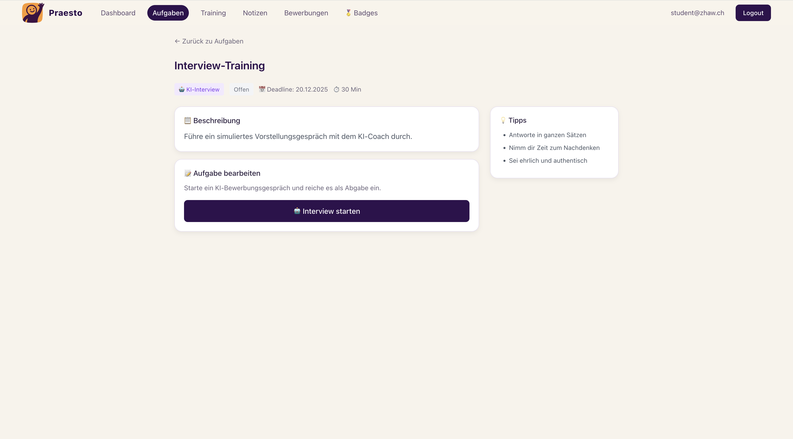

Die Detailansicht einer offenen Aufgabe zeigt:

**Aufgaben-Info:**
- Typ, Status, Deadline und Dauer im Header
- Vollständige Beschreibung der Aufgabe

**Bearbeiten-Bereich:**
Je nach Aufgabentyp wird ein entsprechender Button angezeigt:
- Bei KI-Interview: "Interview starten" - öffnet den KI-Chat
- Bei Dokument: Upload-Bereich für Dateien
- Bei Recherche/Selbstreflexion: Textfeld für die Eingabe

**Tipps:**
Hilfreiche Hinweise für die Bearbeitung, z.B.:
- "Antworte in ganzen Sätzen"
- "Nimm dir Zeit zum Nachdenken"
- "Sei ehrlich und authentisch"

#### Aufgabe mit Feedback
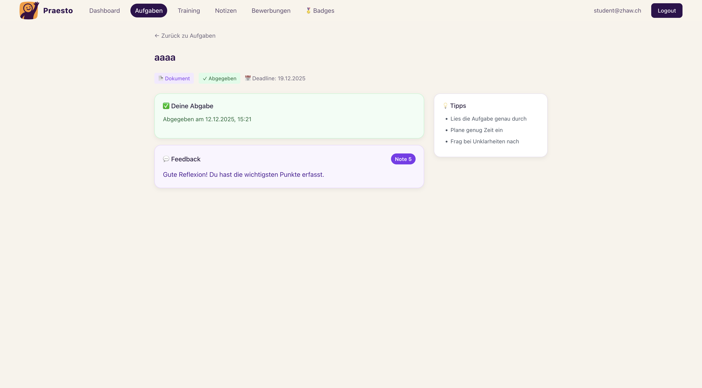

Nach der Bewertung durch die Lehrperson zeigt die Detailansicht:

**Deine Abgabe:**
- Bestätigung dass die Aufgabe abgegeben wurde
- Datum und Uhrzeit der Abgabe

**Feedback:**
- Schriftliches Feedback der Lehrperson
- Note (1-6) als Badge angezeigt

---

#### KI-Training Sessions
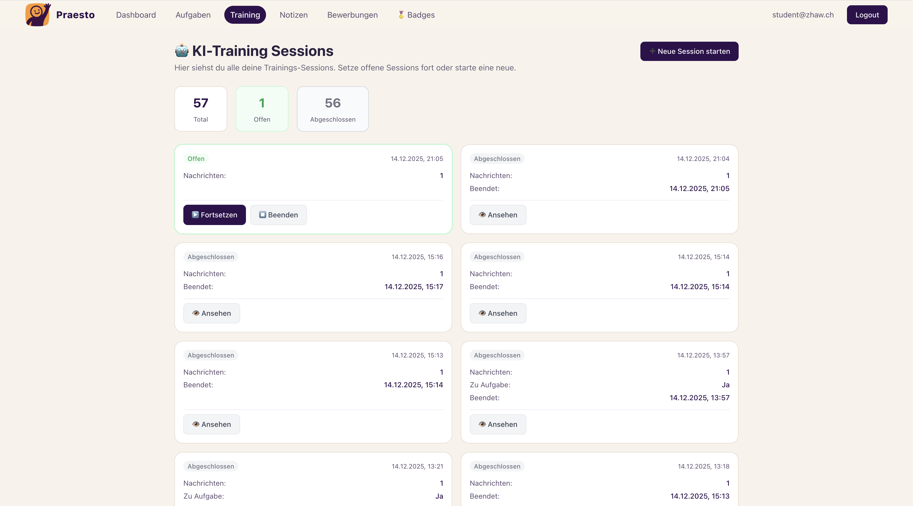

Übersicht aller KI-Trainings-Sessions des Schülers.

**Statistik:**
- Total: Alle jemals gestarteten Sessions
- Offen: Noch nicht beendete Sessions (können fortgesetzt werden)
- Abgeschlossen: Beendete Sessions

**Session-Karten:**
Jede Session zeigt:
- Status (Offen oder Abgeschlossen)
- Startdatum und ggf. Enddatum
- Anzahl Nachrichten im Chat
- Bei Aufgaben-Sessions: "Zu Aufgabe: Ja"

**Aktionen:**
- "Fortsetzen": Öffnet eine offene Session zum Weitermachen
- "Beenden": Schliesst eine offene Session ab
- "Ansehen": Zeigt den Chat-Verlauf einer abgeschlossenen Session
- "+ Neue Session starten": Startet ein neues freies Training

#### KI-Chat (Freies Training)
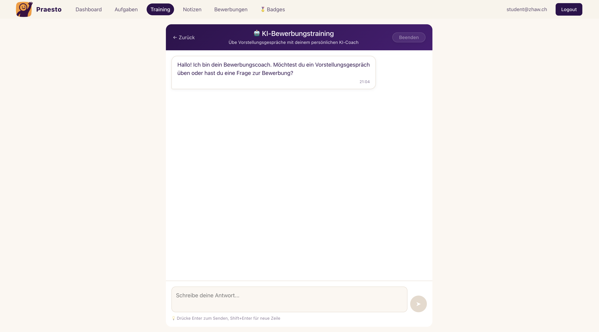

Im freien Training kann der Schüler ohne Zeitdruck üben.

**Header:**
- Titel "KI-Bewerbungstraining"
- "Beenden" Button um die Session abzuschliessen

**Chat-Bereich:**
Der KI-Coach begrüsst den Schüler und bietet zwei Modi an:
1. **Vorstellungsgespräch üben:** Die KI simuliert einen HR-Verantwortlichen und stellt typische Bewerbungsfragen
2. **Fragen zur Bewerbung:** Der Schüler kann Fragen stellen und erhält Tipps

Die Nachrichten werden chronologisch angezeigt mit Zeitstempel. Die KI antwortet auf Deutsch und gibt nach jeder Antwort konstruktives Feedback.

**Eingabe:**
- Textfeld für die Antwort
- Enter zum Senden, Shift+Enter für neue Zeile

#### KI-Chat (mit Aufgabe)
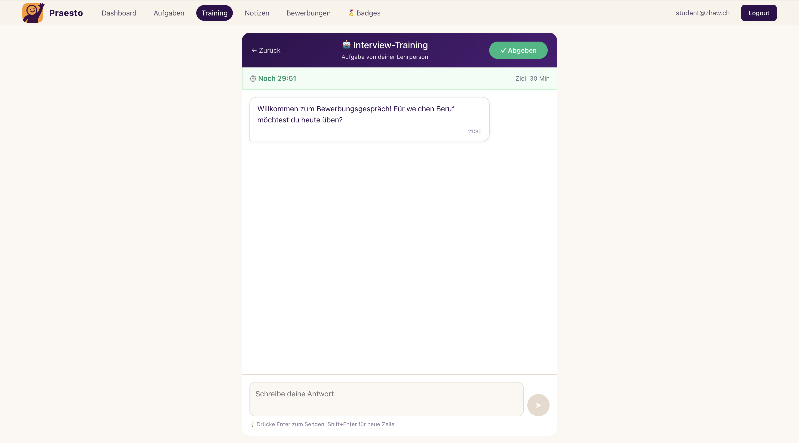

Bei einer Aufgaben-gebundenen Session gibt es zusätzliche Elemente:

**Header:**
- Aufgabentitel statt "KI-Bewerbungstraining"
- Grüner "Abgeben" Button statt "Beenden"

**Timer:**
- Zeigt die verbleibende Zeit (z.B. "Noch 29:51")
- Zielzeit wird rechts angezeigt (z.B. "Ziel: 30 Min")
- Der Timer läuft ab Start und hilft dem Schüler, die Zeit im Blick zu behalten

**Ablauf:**
1. Der Schüler startet das Interview
2. Die KI führt durch ein strukturiertes Bewerbungsgespräch
3. Nach Abschluss klickt der Schüler "Abgeben"
4. Der gesamte Chat-Verlauf wird als Abgabe gespeichert
5. Die Lehrperson kann den Verlauf einsehen und bewerten

---

#### Bewerbungs-Tracker
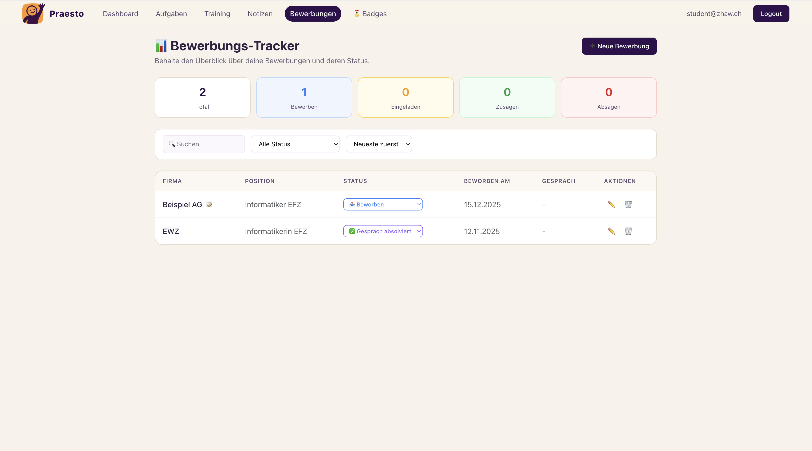

Hier verwaltet der Schüler seine echten Bewerbungen für Lehrstellen.

**Statistik-Leiste:**
- Total: Alle Bewerbungen
- Beworben: Abgeschickte Bewerbungen
- Eingeladen: Einladungen zum Gespräch
- Zusagen: Erfolgreiche Bewerbungen
- Absagen: Abgelehnte Bewerbungen

**Filter:**
- Suchfeld: Suche nach Firmenname
- Status-Filter: Nur bestimmte Status anzeigen
- Sortierung: Neueste zuerst oder älteste zuerst

**Bewerbungs-Tabelle:**
Spalten: Firma, Position, Status, Beworben am, Gespräch am, Aktionen

Der **Status kann direkt in der Tabelle geändert werden** per Dropdown - so muss nicht jede Bewerbung einzeln geöffnet werden.

**Aktionen:**
- Stift-Icon: Bewerbung bearbeiten
- Papierkorb-Icon: Bewerbung löschen

#### Bewerbung erstellen
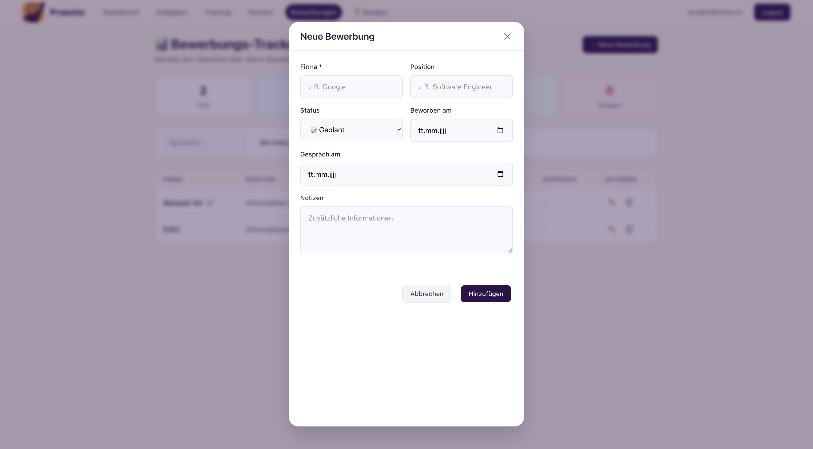

Modal zum Erfassen einer neuen Bewerbung:

- **Firma (Pflichtfeld):** Name des Unternehmens
- **Position:** Lehrberuf oder Stelle
- **Status:** Aktueller Stand (standardmässig "Geplant")
- **Beworben am:** Datum der Bewerbung
- **Gespräch am:** Datum eines allfälligen Vorstellungsgesprächs
- **Notizen:** Zusätzliche Informationen (z.B. Kontaktperson, Telefonnummer)

#### Bewerbung bearbeiten
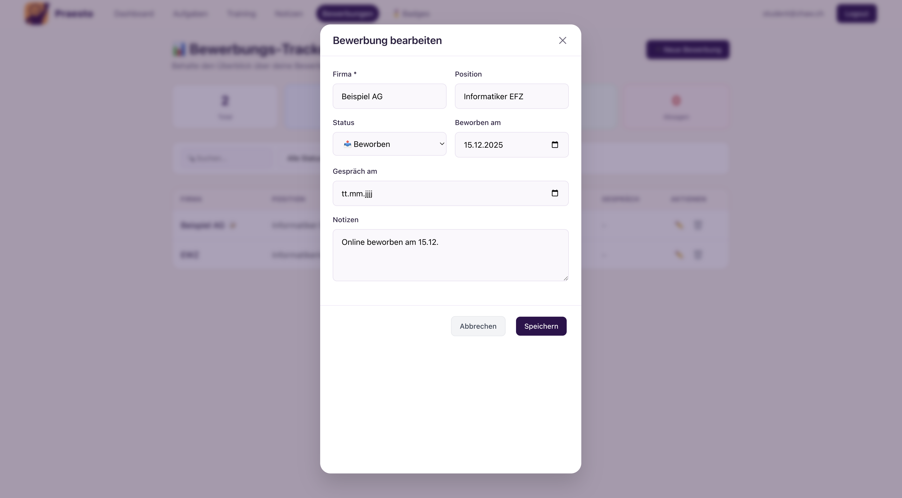

Alle Felder einer bestehenden Bewerbung können angepasst werden. Typische Anwendungsfälle:
- Status aktualisieren nach Rückmeldung
- Gesprächstermin eintragen nach Einladung
- Notizen ergänzen nach Telefongespräch

#### Status ändern
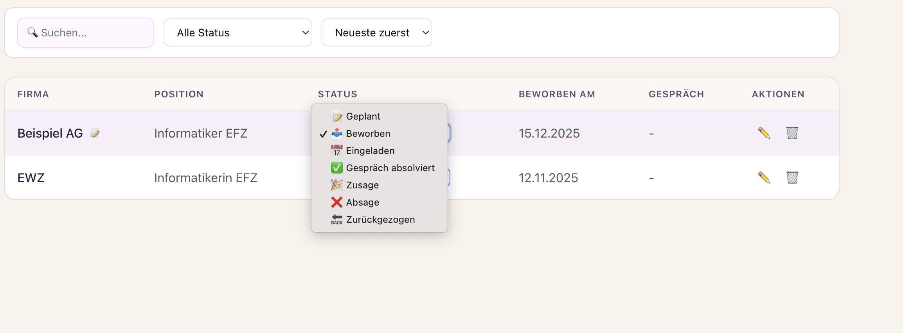

Die verfügbaren Status bilden den typischen Bewerbungsprozess ab:

| Status | Bedeutung |
|--------|-----------|
| 📝 Geplant | Bewerbung ist geplant, aber noch nicht abgeschickt |
| 📤 Beworben | Bewerbung wurde abgeschickt |
| 📅 Eingeladen | Einladung zum Vorstellungsgespräch erhalten |
| ✅ Gespräch absolviert | Vorstellungsgespräch hat stattgefunden |
| 🎉 Zusage | Lehrstelle erhalten |
| ❌ Absage | Absage erhalten |
| 🔙 Zurückgezogen | Bewerbung selbst zurückgezogen |

---

#### Notizen
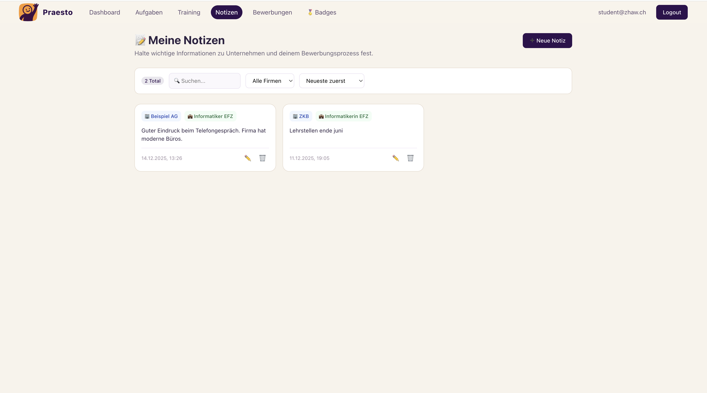

Persönliche Notizen zu Firmen und dem Bewerbungsprozess.

**Filter:**
- Anzahl Notizen total
- Suchfeld für Volltextsuche
- Filter nach Firma
- Sortierung

**Notiz-Karten:**
Jede Notiz zeigt:
- Firma und Position (falls zugeordnet) als Badges
- Notiztext (Vorschau)
- Erstelldatum
- Bearbeiten/Löschen Icons

Notizen können einer Firma/Position zugeordnet werden, um später alle Infos zu einem Unternehmen schnell zu finden.

#### Notiz erstellen
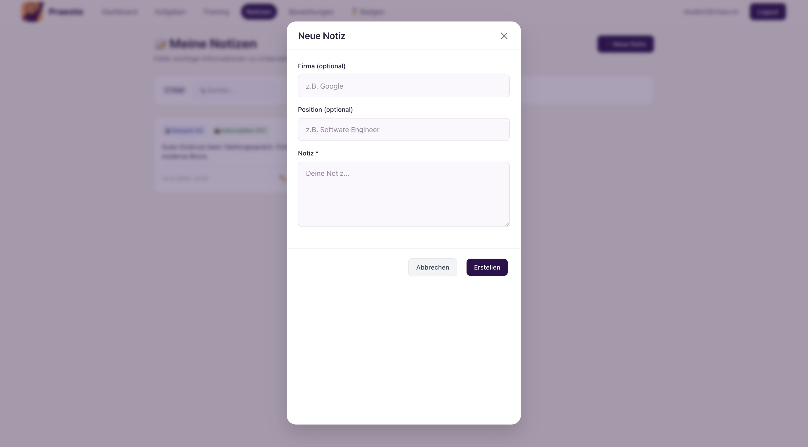

Modal zum Erstellen einer neuen Notiz:

- **Firma (optional):** Zuordnung zu einer Firma
- **Position (optional):** Zuordnung zu einer Position
- **Notiz (Pflichtfeld):** Der eigentliche Notiztext

Anwendungsbeispiele:
- Eindruck nach Schnuppertag
- Infos von Berufsmesse
- Gesprächsnotizen nach Telefonat
- Recherche-Ergebnisse zu Firma

---

#### Badges
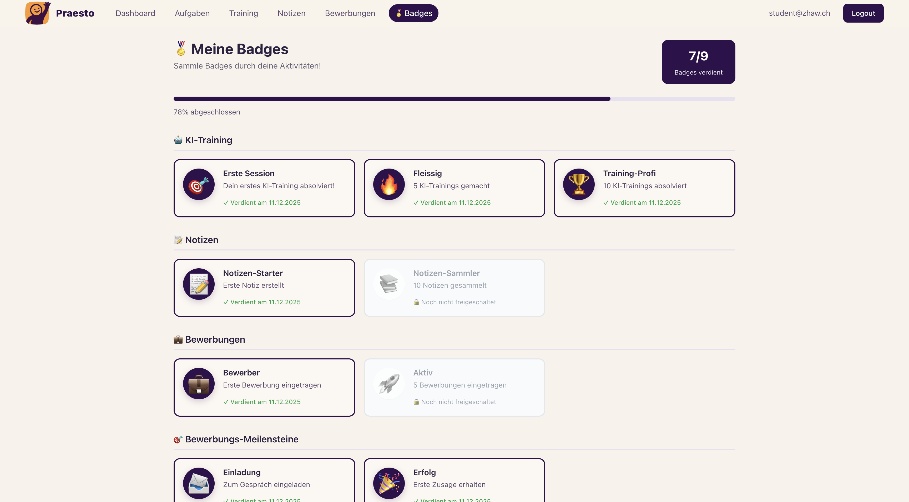

Das Gamification-System motiviert zur regelmässigen Nutzung der App.

**Fortschrittsanzeige:**
- Anzahl verdiente Badges (z.B. "7/9")
- Fortschrittsbalken in Prozent

**Badge-Kategorien:**

| Kategorie | Badges |
|-----------|--------|
| **KI-Training** | Erste Session, Fleissig (5x), Training-Profi (10x) |
| **Notizen** | Notizen-Starter (1x), Notizen-Sammler (10x) |
| **Bewerbungen** | Bewerber (1x), Aktiv (5x) |
| **Meilensteine** | Einladung erhalten, Zusage erhalten |

**Badge-Anzeige:**
- Farbiges Icon und Name bei verdienten Badges
- Ausgegraut bei noch nicht freigeschalteten
- Datum der Freischaltung bei verdienten Badges

Badges werden **automatisch vergeben** sobald die Bedingung erfüllt ist (z.B. 5. KI-Training abgeschlossen).

---

### Teacher-Ansichten

#### Dashboard
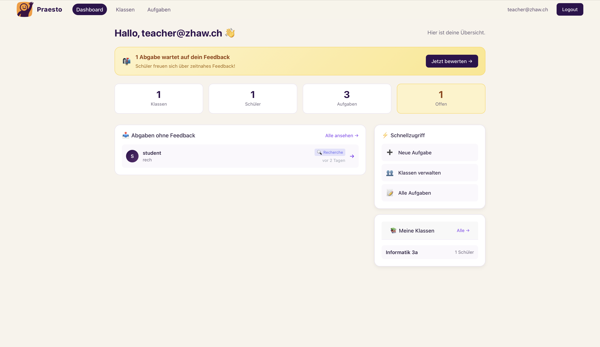

Das Dashboard für Lehrkräfte fokussiert auf Klassenmanagement und ausstehende Bewertungen.

**Alert-Banner:**
Zeigt prominent an, wenn Abgaben auf Feedback warten. Ein Klick auf "Jetzt bewerten" führt direkt zur entsprechenden Aufgabe.

**Statistik-Karten:**
- Anzahl Klassen
- Anzahl Schüler (über alle Klassen)
- Anzahl Aufgaben
- Davon offen (noch nicht alle abgegeben)

**Abgaben ohne Feedback:**
Liste der Schülerabgaben, die noch nicht bewertet wurden. Zeigt Schülername, Aufgabe und wie lange die Abgabe her ist.

**Schnellzugriff:**
- Neue Aufgabe erstellen
- Klassen verwalten
- Alle Aufgaben anzeigen

**Meine Klassen:**
Kompakte Übersicht der eigenen Klassen mit Schülerzahl.

---

#### Klassenverwaltung
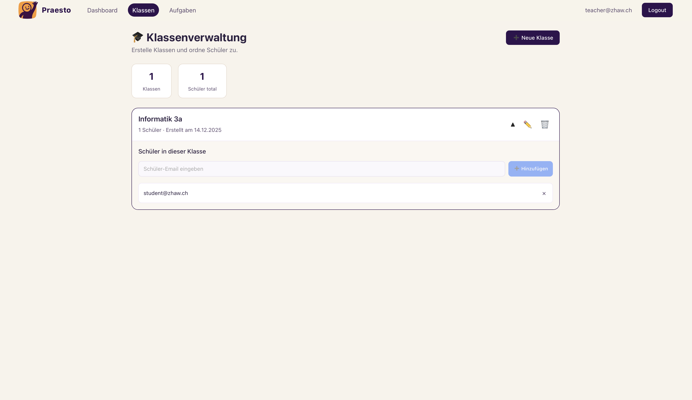

Hier erstellt und verwaltet die Lehrperson ihre Schulklassen.

**Statistik:**
- Anzahl Klassen
- Anzahl Schüler total

**Klassen-Karten:**
Jede Klasse zeigt:
- Klassenname
- Anzahl Schüler
- Erstelldatum
- Aktionen: Bearbeiten, Löschen

**Schüler hinzufügen:**
Die Karte kann aufgeklappt werden und zeigt:
- Liste der aktuellen Schüler (E-Mail-Adressen)
- Eingabefeld für neue E-Mail-Adresse
- "Hinzufügen" Button

**Wichtig:** Schüler werden über ihre E-Mail-Adresse hinzugefügt. Sobald sich jemand mit dieser E-Mail registriert, wird er automatisch der Klasse zugewiesen und sieht die Aufgaben.

#### Klasse bearbeiten
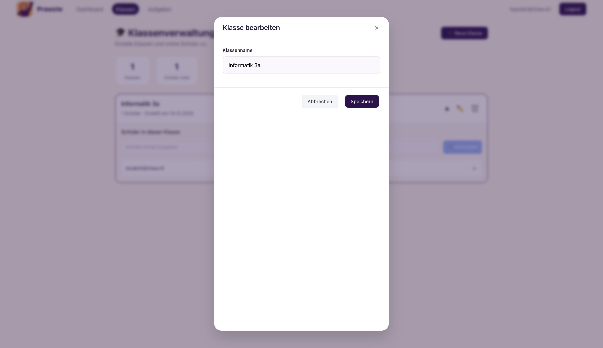

Modal zum Ändern des Klassennamens. Der Name kann jederzeit angepasst werden (z.B. "Informatik 3a" → "Informatik 3a 2025").

---

#### Aufgaben-Übersicht
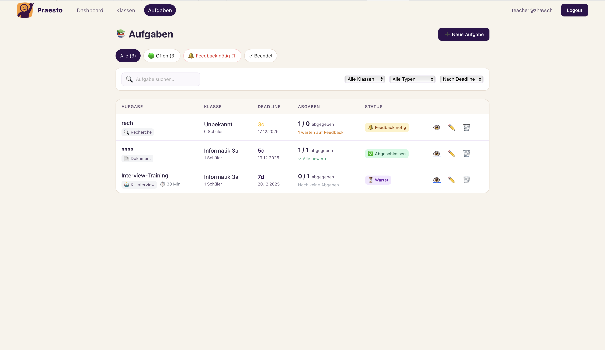

Zeigt alle erstellten Aufgaben mit aktuellem Status.

**Filter-Tabs:**
- Alle: Sämtliche Aufgaben
- Offen: Aufgaben wo noch Abgaben ausstehen
- Feedback nötig: Aufgaben mit unbewerteten Abgaben
- Beendet: Vollständig bewertete Aufgaben

**Filter:**
- Suchfeld für Aufgabentitel
- Filter nach Klasse
- Filter nach Typ
- Sortierung nach Deadline

**Aufgaben-Tabelle:**

| Spalte | Inhalt |
|--------|--------|
| Aufgabe | Titel + Typ-Badge + ggf. Dauer |
| Klasse | Klassenname + Schülerzahl |
| Deadline | Datum + Tage bis Deadline (farbcodiert) |
| Abgaben | "X / Y abgegeben" + Hinweis wenn Feedback fehlt |
| Status | Wartet / Feedback nötig / Abgeschlossen |
| Aktionen | Ansehen, Bearbeiten, Löschen |

**Farbcodierung Deadline:**
- Grün: Mehr als 7 Tage
- Orange: 3-7 Tage
- Rot: Weniger als 3 Tage oder überfällig

#### Aufgabe erstellen
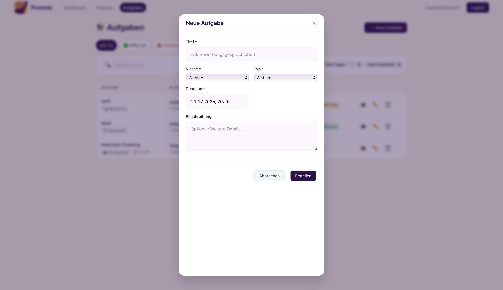

Modal zum Erstellen einer neuen Aufgabe:

- **Titel (Pflichtfeld):** Bezeichnung der Aufgabe
- **Klasse (Pflichtfeld):** Für welche Klasse die Aufgabe ist
- **Typ (Pflichtfeld):** Art der Aufgabe (bestimmt wie Schüler abgeben)
  - KI-Bewerbungsgespräch
  - Selbstreflexion
  - Recherche
  - Dokument einreichen
  - Video-Bewerbung
- **Deadline (Pflichtfeld):** Bis wann die Aufgabe erledigt sein muss
- **Beschreibung (optional):** Detaillierte Anweisungen für die Schüler

Nach dem Erstellen ist die Aufgabe sofort für alle Schüler der Klasse sichtbar.

#### Aufgaben-Detail
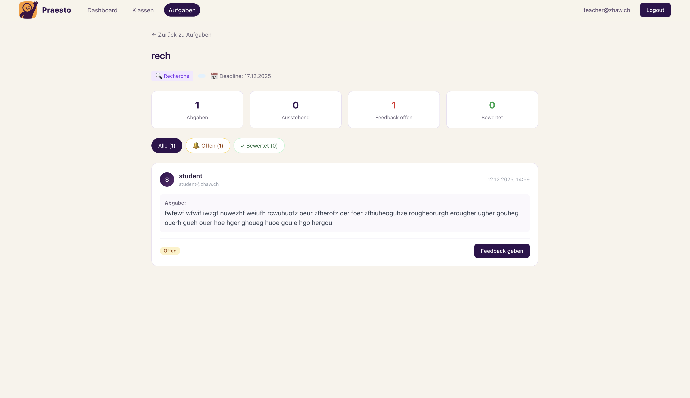

Detailansicht einer Aufgabe mit allen Abgaben.

**Statistik-Karten:**
- Abgaben: Wie viele Schüler haben abgegeben
- Ausstehend: Wie viele fehlen noch
- Feedback offen: Abgaben ohne Bewertung
- Bewertet: Bereits bewertete Abgaben

**Filter-Tabs:**
- Alle: Sämtliche Abgaben
- Offen: Noch nicht bewertet
- Bewertet: Bereits bewertet

**Abgaben-Liste:**
Jede Abgabe zeigt:
- Schüler-Avatar und Name
- E-Mail-Adresse
- Abgabedatum und -zeit
- Inhalt der Abgabe (Text oder Chat-Zusammenfassung)
- Status-Badge (Offen/Bewertet)
- "Feedback geben" Button bei offenen Abgaben

#### Feedback geben
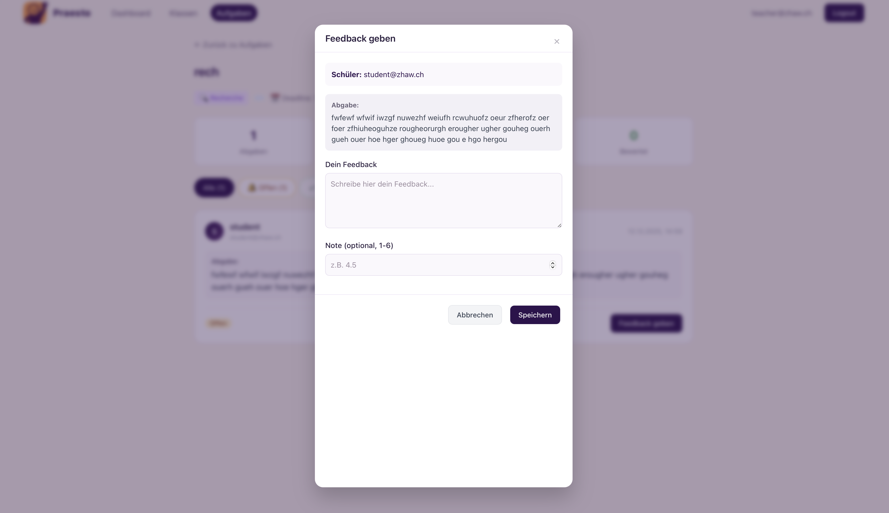

Modal zum Bewerten einer Schülerabgabe:

**Abgabe-Anzeige:**
- Schülername
- Eingereichte Inhalte (bei KI-Interview: der gesamte Chat-Verlauf)

**Feedback-Formular:**
- **Feedback-Text:** Schriftliche Rückmeldung an den Schüler
- **Note (optional):** Bewertung von 1-6 (Schweizer Notensystem)

Nach dem Speichern:
- Der Schüler sieht das Feedback in seiner Aufgabenansicht
- Die Abgabe wird als "Bewertet" markiert
- Bei neuen Feedbacks erscheint eine Benachrichtigung im Schüler-Dashboard

---

## KI-Funktionen

### Architektur

Die KI-Integration basiert auf **Spring AI** mit dem **OpenAI GPT-4** Modell. Die Kommunikation erfolgt über einen ChatClient mit Memory-Funktion, die durch MongoDB realisiert wird.

```
┌─────────────────┐     HTTP/REST     ┌──────────────────┐     HTTPS      ┌─────────────────┐
│    Frontend     │◄─────────────────▶│   Spring Boot    │◄──────────────▶│   OpenAI API    │
│   (SvelteKit)   │                   │     Backend      │                │    (GPT-4)      │
└─────────────────┘                   └────────┬─────────┘                └─────────────────┘
                                               │
                                               │ MongoDB Driver
                                               ▼
                                      ┌─────────────────┐
                                      │  MongoDB Atlas  │
                                      │   (Sessions)    │
                                      └─────────────────┘
```

**Datenfluss einer Chat-Nachricht:**
1. Frontend sendet `POST /api/sessions/{id}/messages` mit User-Nachricht
2. Backend lädt Session mit allen bisherigen Nachrichten aus MongoDB
3. Backend baut Prompt: System-Prompt + alle bisherigen Nachrichten + neue Nachricht
4. Backend sendet Prompt an OpenAI GPT-4
5. OpenAI generiert Antwort basierend auf Kontext
6. Backend speichert User-Nachricht und KI-Antwort in Session
7. Backend gibt KI-Antwort an Frontend zurück
8. Frontend zeigt Antwort im Chat an

---

### Spring AI Integration

**Konfiguration (application.yml):**
```yaml
spring:
  ai:
    openai:
      api-key: ${OPEN_AI_KEY}
      chat:
        options:
          model: gpt-4-turbo-preview
          temperature: 0.7
```

**ChatClient-Verwendung im SessionService:**
```java
@Service
public class SessionService {
    
    private final ChatClient chatClient;
    
    public SessionService(ChatClient.Builder chatClientBuilder) {
        this.chatClient = chatClientBuilder.build();
    }
    
    public String generateResponse(Session session, String userMessage) {
        List<Message> chatMessages = new ArrayList<>();
        
        // 1. System-Prompt hinzufügen
        String systemPrompt = session.getAssignmentId() != null 
            ? ASSIGNMENT_SYSTEM_PROMPT 
            : FREE_TRAINING_SYSTEM_PROMPT;
        chatMessages.add(new SystemMessage(systemPrompt));
        
        // 2. Bisherige Nachrichten hinzufügen (Memory)
        for (SessionMessage msg : session.getMessages()) {
            if ("user".equals(msg.getRole())) {
                chatMessages.add(new UserMessage(msg.getContent()));
            } else {
                chatMessages.add(new AssistantMessage(msg.getContent()));
            }
        }
        
        // 3. Neue User-Nachricht hinzufügen
        chatMessages.add(new UserMessage(userMessage));
        
        // 4. An OpenAI senden
        Prompt prompt = new Prompt(chatMessages);
        return chatClient.prompt(prompt).call().content();
    }
}
```

---

### System-Prompts

Die KI verwendet **zwei verschiedene System-Prompts** je nach Kontext:

#### 1. Freies Training (FREE_TRAINING_SYSTEM_PROMPT)

Für ungebundenes Üben ohne Aufgabe. Der KI-Coach ist flexibel und passt sich dem Schüler an.

**Persona:**
> Du bist ein erfahrener, freundlicher HR-Verantwortlicher eines mittelständischen Schweizer Unternehmens. Du führst Bewerbungsgespräche mit Jugendlichen, die eine Lehrstelle suchen.

**Zwei Modi:**

| Modus | Trigger | Verhalten |
|-------|---------|-----------|
| **Interview-Training** | Schüler nennt Beruf/Firma | Führt realistisches Bewerbungsgespräch |
| **Bewerbungs-Beratung** | Schüler stellt Fragen | Gibt Tipps zu Lebenslauf, Outfit, etc. |

**Frage-Kategorien im Interview-Modus:**
1. **Motivation & Berufswahl**
   - "Warum möchtest du diesen Beruf erlernen?"
   - "Was interessiert dich an unserer Branche?"
   - "Wo siehst du dich in 5 Jahren?"

2. **Persönlichkeit & Stärken**
   - "Was sind deine Stärken und Schwächen?"
   - "Wie würden dich deine Freunde beschreiben?"
   - "Worauf bist du besonders stolz?"

3. **Arbeitsweise & Teamfähigkeit**
   - "Wie gehst du mit Stress um?"
   - "Erzähl von einer Situation, in der du im Team gearbeitet hast"
   - "Wie gehst du mit Konflikten um?"

4. **Praktische Erfahrung**
   - "Hast du ein Schnupperpraktikum gemacht?"
   - "Was hast du dabei gelernt?"
   - "Welche Erfahrungen bringst du mit?"

5. **Culture Fit / Kreative Fragen**
   - "Wenn du ein Tier wärst, welches wärst du und warum?"
   - "Was würdest du mit einer Million Franken machen?"
   - "Welches Buch hat dich zuletzt inspiriert?"

**Feedback-Struktur nach jeder Antwort:**
```
✓ Was war gut an deiner Antwort:
[Positive Aspekte hervorheben]

→ Was du verbessern könntest:
[Konstruktive Kritik]

💡 Tipp: Was HR-Leute bei dieser Frage hören wollen:
[Konkrete Verbesserungsvorschläge]
```

---

#### 2. Aufgaben-Modus (ASSIGNMENT_SYSTEM_PROMPT)

Für aufgabengebundenes Training mit definiertem Zeitrahmen. Strukturierter und bewertungsorientiert.

**Zusätzliche Anweisungen:**
- Strukturierter Ablauf mit 4-6 Fragen
- Zeitrahmen aus der Aufgabe berücksichtigen
- Am Ende: Zusammenfassung mit Schulnote (1-6)
- Fokus auf Effizienz und Bewertbarkeit

**Aufgaben-Kontext wird injiziert:**
```java
String assignmentContext = String.format(
    "Dies ist eine Übung für die Aufgabe '%s'. " +
    "Geplante Dauer: %d Minuten. " +
    "Beschreibung: %s",
    session.getAssignmentTitle(),
    session.getTargetDurationMin(),
    assignment.getDescription()
);
```

---

### Chat-Memory

Die Konversationshistorie wird **pro Session in MongoDB** gespeichert. Bei jeder neuen Nachricht wird der gesamte Verlauf an die KI gesendet.

**Session-Dokument in MongoDB:**
```json
{
  "_id": "session123",
  "studentId": "auth0|abc123",
  "studentEmail": "max.muster@schule.ch",
  "assignmentId": "assignment456",
  "assignmentTitle": "Bewerbungsgespräch üben",
  "targetDurationMin": 15,
  "messages": [
    {
      "role": "assistant",
      "content": "Hallo! Ich bin dein KI-Coach...",
      "createdAt": "2024-01-15T10:00:00Z"
    },
    {
      "role": "user",
      "content": "Ich möchte Informatiker werden",
      "createdAt": "2024-01-15T10:01:00Z"
    },
    {
      "role": "assistant",
      "content": "Super! Informatiker ist ein spannender Beruf...",
      "createdAt": "2024-01-15T10:01:05Z"
    }
  ],
  "status": "OPEN",
  "startedAt": "2024-01-15T10:00:00Z"
}
```

**Vorteile dieser Architektur:**
- ✅ Voller Kontext bei jeder Anfrage
- ✅ Session kann unterbrochen und später fortgesetzt werden
- ✅ Chat-Verlauf ist für Lehrkraft einsehbar
- ✅ Keine zusätzliche Memory-Infrastruktur nötig

---

### API-Endpoints für KI-Chat

| Endpoint | Methode | Beschreibung |
|----------|---------|--------------|
| `/api/sessions` | POST | Neue Session starten (mit optionalem `assignmentId`) |
| `/api/sessions/{id}` | GET | Session mit allen Nachrichten laden |
| `/api/sessions/{id}/messages` | POST | Neue Nachricht senden, KI-Antwort erhalten |
| `/api/sessions/{id}/close` | PUT | Session beenden (freies Training) |
| `/api/sessions/{id}/submit` | PUT | Session als Aufgabe abgeben |
| `/api/sessions` | GET | Alle eigenen Sessions auflisten |

---

## Drittsysteme

### Auth0 (Authentifizierung)

**Zweck:** Sichere Benutzerauthentifizierung und Rollenverwaltung ohne eigenes User-Management.

**Warum Auth0?**
- Sichere Passwort-Speicherung (gehashed, gesalzen)
- OAuth2/OpenID Connect Standard
- Einfache Rollenverwaltung
- Social Login möglich (Google, etc.)
- Keine eigene Security-Implementation nötig

**Integration im Backend:**

```java
// SecurityConfig.java
@Configuration
@EnableWebSecurity
public class SecurityConfig {
    
    @Bean
    public SecurityFilterChain filterChain(HttpSecurity http) throws Exception {
        http
            .authorizeHttpRequests(auth -> auth
                .requestMatchers("/api/student/**").hasRole("STUDENT")
                .requestMatchers("/api/teacher/**").hasRole("TEACHER")
                .requestMatchers("/api/**").authenticated()
                .anyRequest().permitAll()
            )
            .oauth2ResourceServer(oauth2 -> oauth2
                .jwt(jwt -> jwt.jwtAuthenticationConverter(jwtAuthConverter()))
            );
        return http.build();
    }
}
```

**Rollen-Extraktion aus JWT:**

```java
// JwtRoleConverter.java
public class JwtRoleConverter implements Converter<Jwt, AbstractAuthenticationToken> {
    
    private static final String ROLES_CLAIM = "https://praesto.ch/roles";
    
    @Override
    public AbstractAuthenticationToken convert(Jwt jwt) {
        Collection<GrantedAuthority> authorities = extractRoles(jwt);
        return new JwtAuthenticationToken(jwt, authorities);
    }
    
    private Collection<GrantedAuthority> extractRoles(Jwt jwt) {
        List<String> roles = jwt.getClaimAsStringList(ROLES_CLAIM);
        return roles.stream()
            .map(role -> new SimpleGrantedAuthority("ROLE_" + role))
            .collect(Collectors.toList());
    }
}
```

**Konfiguration (application.yml):**
```yaml
spring:
  security:
    oauth2:
      resourceserver:
        jwt:
          issuer-uri: https://${AUTH0_DOMAIN}/
          audiences: ${AUTH0_AUDIENCE}
```

**Rollen in Auth0:**
| Rolle | Beschreibung | Zugriff |
|-------|--------------|---------|
| `STUDENT` | Schüler:in | Dashboard, Chat, Aufgaben, Bewerbungen, Notizen, Badges |
| `TEACHER` | Lehrkraft | Dashboard, Klassen, Aufgaben, Abgaben, Feedback |

---

### MongoDB Atlas (Datenbank)

**Zweck:** Persistente Datenspeicherung in einer flexiblen NoSQL-Datenbank.

**Warum MongoDB?**
- Flexible Schema-Struktur (gut für eingebettete Dokumente wie Messages)
- Cloud-hosted via Atlas (kein Server-Management)
- Gute Spring Data Integration
- Kostenloser M0 Tier für Entwicklung

**Collections:**

| Collection | Inhalt | Dokumente |
|------------|--------|-----------|
| `classes` | Schulklassen | Name, teacherId, studentEmails[] |
| `assignments` | Aufgaben | Titel, Typ, Deadline, classId |
| `submissions` | Abgaben | assignmentId, studentEmail, Status, Feedback |
| `sessions` | KI-Chat-Sessions | studentId, messages[], Status |
| `applications` | Bewerbungen | Firmenname, Position, Status |
| `notes` | Notizen | Text, Firmenname (optional) |
| `badges` | Badge-Definitionen | Titel, Icon, RuleType, Threshold |
| `user_badges` | Verdiente Badges | studentId, badgeId, earnedAt |

**Konfiguration (application.yml):**
```yaml
spring:
  data:
    mongodb:
      uri: ${MONGODB_URI}
      database: Praesto
```

**Beispiel Repository:**
```java
@Repository
public interface SessionRepository extends MongoRepository<Session, String> {
    
    List<Session> findByStudentIdOrderByStartedAtDesc(String studentId);
    
    List<Session> findByAssignmentId(String assignmentId);
    
    long countByStudentIdAndStatus(String studentId, SessionStatus status);
}
```

**Eingebettete Dokumente:**
Messages werden direkt in der Session gespeichert (kein separates Collection):
```java
@Document(collection = "sessions")
public class Session {
    @Id
    private String id;
    
    @Builder.Default
    private List<SessionMessage> messages = new ArrayList<>();  // Eingebettet!
    
    // ...
}
```

---

### OpenAI API (KI)

**Zweck:** Generierung der KI-Coach-Antworten für realistische Bewerbungsgespräche.

**Modell:** GPT-4 Turbo (`gpt-4-turbo-preview`)

**Warum GPT-4?**
- State-of-the-art Sprachverständnis
- Natürliche, kontextbezogene Antworten
- Gutes Verständnis für Rollenspiele (HR-Coach)
- Kann Feedback strukturiert geben

**Integration via Spring AI:**
```yaml
spring:
  ai:
    openai:
      api-key: ${OPEN_AI_KEY}
      chat:
        options:
          model: gpt-4-turbo-preview
          temperature: 0.7      # Kreativität (0-1)
          max-tokens: 1000      # Max. Antwortlänge
```

**Features genutzt:**
- **Chat Completions API:** Für Konversationen
- **System Messages:** Für Persona/Verhalten des Coaches
- **Konversationshistorie:** Für kontextbezogene Antworten

---

## Optionale Anforderungen

Die folgenden optionalen Anforderungen aus der Projektausschreibung wurden umgesetzt:

| Anforderung | Status | Beschreibung |
|-------------|--------|--------------|
| **Codeanalyse mit SonarQube** | ✅ Umgesetzt | SonarCloud-Integration für statische Code-Analyse |
| **Komplexes Datenmodell** | ✅ Umgesetzt | 8 Collections, 6 Enums, eingebettete Dokumente |
| **Komplexes Frontend** | ✅ Umgesetzt | SvelteKit, 20+ Screens, rollenbasiert |
| **Zugriff auf Drittsysteme** | ✅ Umgesetzt | Auth0, OpenAI, MongoDB Atlas |
| **Komplexe Benutzerverwaltung** | ✅ Umgesetzt | Auth0 mit Rollen, Klassenzugehörigkeit |
| **Komplexe Abfragen** | ✅ Umgesetzt | 20+ Repository-Methoden mit Filtern |
| **Detaillierte GitHub-Doku** | ✅ Umgesetzt | Issues, Project Board, Roadmap |
| **Mehrere Branches** | ✅ Umgesetzt | main, develop, feature/, fix/ |
| **Backend mit MCP-Server** | ❌ Nicht umgesetzt | - |
| **End-to-End Tests** | 🔶 Teilweise | Unit-/Integrationstests vorhanden |

---

### Codeanalyse mit SonarQube

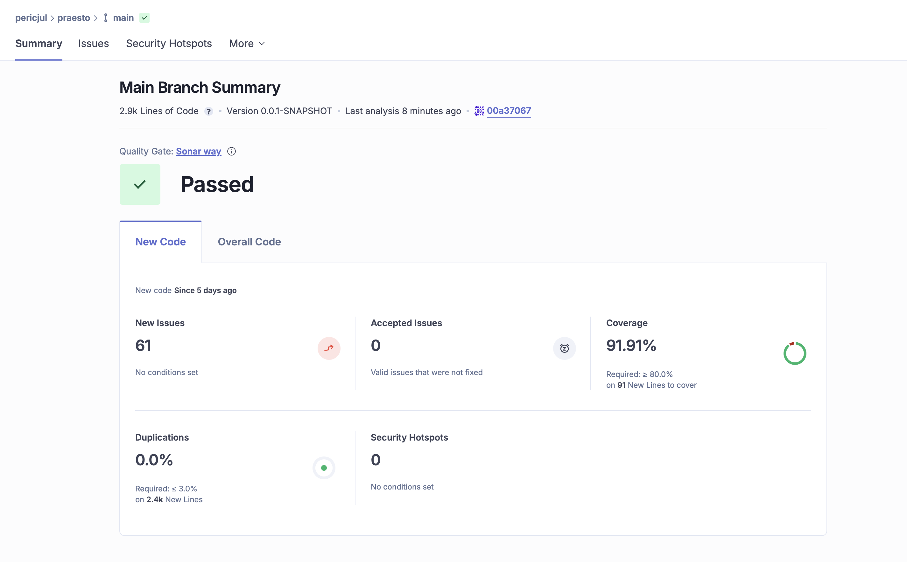

**Integration:** [SonarCloud Dashboard](https://sonarcloud.io/summary/overall?id=ch.zhaw.pericjul.praesto-original&branch=main)

Die Codequalität wird kontinuierlich mit **SonarCloud** überwacht. Bei jedem Push wird automatisch eine Analyse durchgeführt.

**Coverage-Exclusions (JaCoCo):**

Bestimmte Klassen wurden bewusst von der Coverage-Messung ausgeschlossen, da Tests hier keinen Mehrwert bieten:

```xml
<plugin>
    <groupId>org.jacoco</groupId>
    <artifactId>jacoco-maven-plugin</artifactId>
    <configuration>
        <excludes>
            <exclude>**/config/**</exclude>
            <exclude>**/security/JwtRoleConverter.class</exclude>
            <exclude>**/security/SecurityConfig.class</exclude>
            <exclude>**/PraestoApplication.class</exclude>
        </excludes>
    </configuration>
</plugin>
```

| Ausgeschlossen | Begründung |
|----------------|------------|
| `**/config/**` | Konfigurationsklassen enthalten nur Bean-Definitionen ohne Logik |
| `JwtRoleConverter` | Erfordert vollständigen Security-Context, Integration wird durch Controller-Tests abgedeckt |
| `SecurityConfig` | Spring Security-Konfiguration, wird durch @WebMvcTest implizit getestet |
| `PraestoApplication` | Main-Klasse startet nur Spring Boot – kein testbarer Code |

**Vorteile der SonarQube-Integration:**
- Frühzeitige Erkennung von Code-Problemen
- Automatisierte Code-Reviews
- Dokumentation der Code-Qualität
- Motivation für sauberen Code

---

### Komplexes Datenmodell

Das Datenmodell geht über die Mindestanforderung von 3 Entitäten deutlich hinaus:

**8 MongoDB Collections:**
1. `classes` – Schulklassen
2. `assignments` – Aufgaben
3. `submissions` – Abgaben
4. `sessions` – KI-Chat-Sessions
5. `applications` – Bewerbungen
6. `notes` – Notizen
7. `badges` – Badge-Definitionen
8. `user_badges` – Verdiente Badges

**6 Enumerationen:**
1. `AssignmentType` – 5 Werte mit displayName und description
2. `AssignmentStatus` – 5 Zustände
3. `SubmissionStatus` – 4 Zustände
4. `SessionStatus` – 2 Zustände
5. `ApplicationStatus` – 7 Zustände
6. `BadgeRuleType` – 7 Regel-Typen

**Eingebettete Dokumente:**
- `SessionMessage` in `Session` (1:n eingebettet)

**Beziehungstypen:**
- 1:n – Teacher → Classes, Class → Assignments, etc.
- n:m – User ↔ Badge (via UserBadge)
- 1:1 – Session ↔ Submission (bei Abgabe)

**Zustandsmaschinen:**
- Assignment durchläuft 5 Zustände
- Submission durchläuft 4 Zustände
- Session durchläuft 2 Zustände
- Application durchläuft 7 Zustände

---

### Komplexes Frontend

Das Frontend wurde mit **SvelteKit** (Svelte 5) und einem **eigenen CSS Design System** entwickelt.

**Umfang:**
- **20+ Screens** für Student und Teacher
- **Rollenbasierte Navigation** (automatische Weiterleitung)
- **Responsive Design** für Desktop und Mobile
- **Echtzeit-Updates** im Chat

**Technische Highlights:**

| Feature | Implementation |
|---------|----------------|
| **Authentifizierung** | Auth0 SDK + SvelteKit Hooks |
| **State Management** | Svelte Stores für globalen State |
| **API-Aufrufe** | Axios mit Bearer Token |
| **Styling** | Eigenes CSS Design System mit CSS Variables |
| **Timer** | Reaktiver Countdown mit Svelte |
| **Chat-UI** | Auto-Scroll, Loading States |
| **Formulare** | Validierung, Error Messages |
| **Benachrichtigungen** | Toast-Messages |
| **Filter/Sortierung** | Client-side mit Svelte Reactivity |

**Komponenten-Bibliothek:**
- Wiederverwendbare UI-Komponenten
- Konsistentes Design-System mit CSS Variables
- Eigene CSS-Klassen in `theme.css` und `components.css`

---

### Komplexe Benutzerverwaltung

Die Benutzerverwaltung kombiniert Auth0 mit applikationsspezifischer Logik:

**Auth0-Seite:**
- Benutzer-Authentifizierung
- Passwort-Management
- Rollen-Zuweisung (`STUDENT`, `TEACHER`)
- JWT-Token mit Custom Claims

**Applikations-Seite:**
- Klassenzugehörigkeit via Email
- Automatische Zuordnung beim Login
- Rollenspezifische Endpoints
- Daten-Isolation (Student sieht nur eigene Daten)

**Ablauf der Klassenzuordnung:**
1. Teacher erstellt Klasse mit Schüler-Emails
2. Schüler registriert sich bei Auth0 mit seiner Email
3. Beim Login: Backend sucht Klassen mit dieser Email
4. Schüler sieht automatisch Aufgaben seiner Klasse(n)

**Security-Implementierung:**
```java
@PreAuthorize("hasRole('TEACHER')")
@PostMapping("/api/classes")
public ResponseEntity<SchoolClass> createClass(@RequestBody SchoolClassDTO dto) {
    String teacherId = getCurrentUserId();  // Aus JWT
    return classService.create(dto, teacherId);
}
```

---

### Komplexe Datenbankabfragen

Über 20 Repository-Methoden mit verschiedenen Abfrage-Patterns:

**Beispiele:**

```java
// SessionRepository
List<Session> findByStudentIdOrderByStartedAtDesc(String studentId);
List<Session> findByStudentIdAndStatus(String studentId, SessionStatus status);
long countByStudentIdAndStatus(String studentId, SessionStatus status);

// SubmissionRepository
List<Submission> findByAssignmentIdOrderBySubmittedAtDesc(String assignmentId);
List<Submission> findByStudentEmailAndStatusIn(String email, List<SubmissionStatus> statuses);
Optional<Submission> findByAssignmentIdAndStudentEmail(String assignmentId, String email);

// ApplicationRepository
List<Application> findByStudentIdOrderByUpdatedAtDesc(String studentId);
long countByStudentIdAndStatus(String studentId, ApplicationStatus status);

// SchoolClassRepository
List<SchoolClass> findByTeacherId(String teacherId);
List<SchoolClass> findByStudentEmailsContaining(String email);
```

**Aggregationen:**
```java
// ApplicationService - Statistiken
public ApplicationStats getStats(String studentId) {
    return ApplicationStats.builder()
        .total(repo.countByStudentId(studentId))
        .applied(repo.countByStudentIdAndStatus(studentId, APPLIED))
        .invited(repo.countByStudentIdAndStatus(studentId, INVITED))
        .accepted(repo.countByStudentIdAndStatus(studentId, ACCEPTED))
        .rejected(repo.countByStudentIdAndStatus(studentId, REJECTED))
        .build();
}
```

---

### Detaillierte GitHub-Dokumentation

**GitHub Issues:**
- Alle Features als Issues dokumentiert
- Klare Beschreibungen und Akzeptanzkriterien
- Labels für Kategorisierung (feature, bug, enhancement)
- Zuordnung zu Sprints

**GitHub Project Board:**
- Kanban-Board mit Spalten: Backlog, Ready, In Progress, Done
- Roadmap-Ansicht mit Zeitachse
- Iteration Planning für Sprints

**Labels verwendet:**
| Label | Farbe | Verwendung |
|-------|-------|------------|
| `backend` | Pink | Backend-bezogen |
| `frontend` | Dunkelblau | Frontend-bezogen |
| `testing` | Grün | Tests |
| `documentation` | Cyan | Dokumentation |
| `enhancement` | Lila | Verbesserung |
| `ux` | Hellgrün | UX/Design |

---

### Testabdeckung

**Unit- und Integrationstests:**

| Bereich | Testklassen | Abdeckung |
|---------|-------------|-----------|
| Controller | 10 | Alle Endpoints getestet |
| Services | 9 | Geschäftslogik |
| Config | 2 | OpenAI, JWT |
| Model | 5 | Validation, Enums, Exceptions |

**Test-Technologien:**
- JUnit 5
- Mockito für Mocking
- @SpringBootTest für Integrationstests
- @WebMvcTest für Controller-Tests
- MockMvc für HTTP-Tests

**Beispiel Controller-Test:**
```java
@WebMvcTest(SessionController.class)
class SessionControllerTest {
    
    @Autowired
    private MockMvc mockMvc;
    
    @MockBean
    private SessionService sessionService;
    
    @Test
    @WithMockUser(roles = "STUDENT")
    void shouldCreateSession() throws Exception {
        // Given
        Session session = Session.builder().id("123").build();
        when(sessionService.create(any())).thenReturn(session);
        
        // When & Then
        mockMvc.perform(post("/api/sessions")
                .contentType(MediaType.APPLICATION_JSON)
                .content("{\"assignmentId\": null}"))
            .andExpect(status().isOk())
            .andExpect(jsonPath("$.id").value("123"));
    }
}
```
---

# Fazit

## Stand der Implementation

Alle Pflichtanforderungen wurden erfolgreich umgesetzt. Die Anwendung ist funktionsfähig und unter [praesto.azurewebsites.net](https://praesto.azurewebsites.net) erreichbar.

| Feature | Status |
|---------|--------|
| KI-Bewerbungstraining (Chat) | ✅ |
| Aufgabenverwaltung (5 Typen) | ✅ |
| Bewerbungs-Tracker | ✅ |
| Notizen | ✅ |
| Badges/Gamification | ✅ |
| Klassenverwaltung (Teacher) | ✅ |
| Feedback-System | ✅ |

---

## Nächste Schritte

Das Projekt wurde in mehreren Iterationen im [GitHub Project Board](https://github.com/users/pericjul/projects/4/views/6?visibleFields=%5B%22Title%22%2C%22Linked+pull+requests%22%2C239687378%2C239687380%2C%22Labels%22%5D) geplant und umgesetzt. Alle geplanten Issues wurden erfolgreich abgeschlossen.

Für zukünftige Weiterentwicklungen sind folgende Features geplant und im Backlog hinterlegt:
- Email-Benachrichtigungen bei neuen Aufgaben/Feedback
- Datei-Upload für Dokument- und Video-Aufgaben
- Voice-Chat für realistischere Gespräche

